Benchmark Dose Analysis
=======================

Introduction
------------

Benchmark dose analysis consists of fitting dose-response data to a collection of parameterized equations (models), followed by choosing the model that best describes the data while minimizing complexity (i.e., the best fit model). Alternatively, non-parametric (GCurveP) modelling may be performed.

To perform BMD computations, select complete or prefiltered results from the *Data Selection Area*, and click `Tools > Benchmark Dose Analysis`. Then choose either `EPA BMDS Models`, `Sciome GCurveP`, or `ToxicR Model Averaging`.

[Video describing Benchmark Dose Analysis setup](https://www.youtube.com/watch?v=Ke-Bri5b2Rc&list=PLX2Rd5DjtiTeR84Z4wRSUmKYMoAbilZEc&index=8)

[Document describing model inputs and outputs, and of the best model selection work flow](assets/images/files/BMDExpress2-%20running%20BMDS%20models.pdf)

[Document describing GCurveP method and work flow](gcurvep)

[Document describing ToxicR Model Averaging](https://pmc.ncbi.nlm.nih.gov/articles/PMC9997717/)

### Benchmark Dose Data Options (ToxicR Model Averaging)

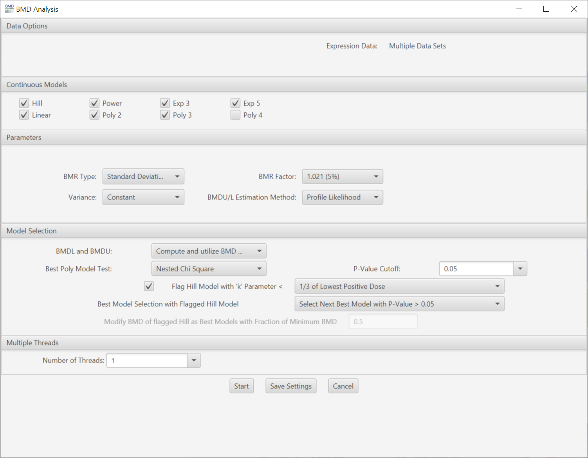

<h4 style="margin-top: 0;">Data Options</h4>

Lists expression data and any pre-filtering in the current workflow.

#### Continuous Models

Choose model(s) for curve fitting. Some of the models will be selected by default. The number of polynomial models available is automatically determined by the unique number of doses comprising the dose-response data. Any single model or combination of models may be chosen.

 

Model Equations for continuous models from the EPA BMDS software that are implemented in BMDExpress 3 are shown below, and described in greater depth in the [BMDS User Manual](https://www.epa.gov/sites/production/files/2015-01/documents/benchmark_dose_guidance.pdf). For all equations, µ is the mean response predicted by the model.

- **Polynomial model:** `μ(dose)=β_0+β_(1 )  dose+ β_(2 )  dose^2+ ⋯  + β_(n )  dose^n` where n is the degree of the polynomial.

- **Linear model:** The linear model is a special case of the polynomial model with n fixed at 1.

- **Power model:** `μ(dose)=γ+ β  dose^δ` where 0 < γ < 1, β ≥ 0, and 18 ≥ δ > 0.

- **Hill model:**   μ(dose)=γ+  (v dose^n)/(k^n+ dose^n )

- **Exponential 2:**   μ(dose)=a*exp⁡(sign* b*dose)

- **Exponential 3:**   μ(dose)=a*exp⁡(sign* (b*dose)^d)

- **Exponential 4:**   μ(dose)=a*(c-(c-1)*exp⁡(-1* b*dose))

- **Exponential 5:**   μ(dose)=a*(c-(c-1)*exp⁡(-1* (b*dose)^d ))

#### [Parameters](#toxicr-popup)

Curve fitting is performed using methods implemented in the U.S. Environmental Protection Agency’s BMDS. Adverse direction is determined automatically in the curve fitting computation (i.e., determined by the linear trend test embedded in the model). Parameters that cannot be altered by the user are: benchmark response (BMR) type (set to Std Dev), relative function convergence (set to 1e-8), parameter convergence (set to 1e-8), BMDL curve calculation (set to 1), BMDU curve calculation (set to 1) and smooth option (set to 0). For Hill, Power, and all exponential models the power parameter is  restricted to be >= 1. For poly models power is a fixed value defined by the degree of the polynomial. Confidence Level = 95%.
- **BMR Type:** Standard deviation or relative deviation.  A relative deviation BMR is a specific percentage change from the fitted value at control. In contrast, an SD-based BMR defines the response as a change from the fitted value at control that is equal to a multiple of the standard deviation of the model. 
- **BMR Factor:** Also called the benchmark response or critical effect size in some publications, the number of standard deviations at which the BMD is defined. The BMR is defined relative to the response at control. Since both the response at control and the standard deviation or relative deviation used to calculate the BMR are parameters estimated as part of the curve fit, the BMR may change when the model used to fit the data changes. With continuous data EPA recommends the use of a standard deviation BMR type with a BMR factor is 1 (equivalent to 1 standard deviation) when the critical effect size is unknown. In case of gene expression (i.e. [EPA ETAP standards](https://www.epa.gov/etap)) the recommended BMR factor is 1.349. In the case of relative deviation (equivalent to a modelled fold change) in the context of gene expression thresholds can vary but empirical assessment indicates a 25% (1.25 fold change) to 50% (1.5 fold change) generally provide reliable results that tend to have greater repeatability compared to standard deviation-based BMR values.
- **Monotonic Poly2:** When selected the poly2 model is restricted to monotonicity.
- **Variance:** Assumption of what the spread of the data is across different dose levels. A constant variance (homoscedasticity) assumption posits that the variability of the response is the same at all doses. In contrast, a non-constant variance (heteroscedasticity) assumption allows the variability to change as the dose increases, often being modeled as proportional to a power of the mean response. In the case of transcriptomic data most of the time it is log transformed to meet assumptions of common statistical tests, hence it homoscedastic (exhibits constant variance) in most cases. Options are constant or non-constant.
- **BMDU/L Estimation Method:** The Wald method first approximates the variance of the BMD estimate and then uses that variance to construct a confidence interval, typically assuming a normal distribution for the estimate. In contrast, the Profile Likelihood method does not rely on a single variance estimate but instead calculates the confidence limits by finding the range of BMD values for which the log-likelihood of the model does not fall too far below its maximum value. Options: Profile likelihood or Wald/Ewald Method. 
- **Step-Function Threshold:** This evaluates the fitted curve to determine if there is a percentage of overall change that takes place between 2 dose levels (i.e. it identifies the curves that exhibit rapid/large change between two adjacent dose levels). For example if the setting is 0.5 that would identify fits where 50% or more of the response occurs between 2 dose levels based on the fit of the model.  This identifies curves that are potentially biologically implausible, that said, use of this metric in subsequent analysis steps should be carefully considered particularly when a study employs broad dose spacing (e.g. 10-fold) or a limited number of dose levels (e.g.<=5).

#### [Model Selection](#toxicr-popup)
- **BMDL and BMDU:** Choose whether you want these metrics computed or not, and whether to include them in best model selection criteria. Historically there was a requirement to have all of these metrics converge in order to allow for a model to be selected as a best model. However, this was problematic in certain cases because an otherwise good fit to the data would be removed if it had a non-convergent upper bound. Hence, this option was added. Options: Compute and utilize BMD and BMDL in best model selection; Compute and utilize BMD, BMDL and BMDU in best model selection; Compute but ignore non-convergence in best model selection; Do not compute
- **Best Poly Model Test:**
    - *Nested Chi Square:* A nested likelihood ratio test is used to select among the linear and polynomial (2° polynomial, 3° polynomial, etc.) models followed by an Akaike information criterion (AIC) comparison (i.e., the model with the lowest AIC is selected) among the best nested model, the Hill model and the power model.
    - *Lowest AIC:* A completely AIC-based selection process is performed.
- ***P*-Value Cutoff:** Statistical threshold for the Nested Chi Square test when selecting the best linear/poly model

- **Flag Hill Model with ‘k’ Parameter &lt; :** If the Hill model is selected as one of the models to fit the data, flag a Hill model if its ‘k’ parameter is smaller than the lowest positive dose, or a fraction (1/2, or 1/3) of the lowest positive dose. This option is included since the Hill model can provide unrealistic BMD and BMDL values for certain dose response curves even when it provides the lowest AIC value. For flagged Hill models, there are multiple options when selecting the best model:
    - *Include Flagged Hill Models:* There is no additional condition applied when selecting the best model.
    - *Exclude Flagged Hill from Best Models:* The flagged Hill model will not be considered when selecting the best model.
    - *Exclude All Hill from Best Models*: All Hill models, either flagged or not, will not be considered when selecting the best model.
    - *Modify BMD if Flagged Hill as Best Model*: If a flagged Hill model is selected as the best model, then modify its BMD value based on a defined fraction of the lowest BMD from the feature/probe set in the data set with a non-flagged Hill model as the best fit model. Note: With this option the user will need to enter a value in the "Modify BMD of flagged Hill as Best Models with Fraction of Minimum BMD". The default value for this parameter is 0.5. Warning: we do not recommend doing this if the object is to identify individual feature or gene BMD values because this can provide an inaccurate estimate of potency. 
    - *Select Next Best Model with P-Value &gt; 0.05*: The next best model will be selected that meets both the minimum AIC value and a goodness-of-fit p-Value &gt; 0.05. If another model can not be identified to replace the flagged Hill model a BMD, BMDL and BMDU value is assigned to the probe that equals 0.5*the lowest BMD, BMDL and BMDU of the best models after excluding the flagged Hill models. 

#### [Multiple Threads](#toxicr-popup)

- **Warning:** Before selecting the settings in this section the user will want to perform testing to determine the optimal parameter setting to ensure complete model execution. To start the optimization process it is suggested that the user set their threads to no more than 4 times the number of cores available and set the model execution time out to 600 seconds. In windows the number of cores can be found in the "Task Manager" under the "Performance" tab. Once the Benchmark Dose modeling is finished the user will want to check th results table to determine if all models for all features executed to completion (i.e., a "true" value is shown in the "<_model name_> Execution" column). For details see the tutorial video on [Threads and Model Execution Timeout](https://youtu.be/Oualq0CKgY8).

- **Number of threads:** This option allows the user to perform multiple model fit computations in parallel by utilizing multiple CPU cores. The option increases the efficiency of CPU usage and significantly reduces the computational time. For example, a computer with a quad-core processor will theoretically require 1/4th the time to complete model fitting when 4 threads are selected rather than 1 thread. In practice, the actual efficiency varies. Try different values to optimize in your particular situation. Open a processor monitoring utility, and observe processor utilization. Typically, utilization of >80% can be achieved when setting the number of threads to be several to 10-fold greater than the number of processor cores. The default recommendation for the number of threads is 4 times the number of cores that are available, assuming that the user is employing the recommended 600 second model time out (see **Model Execution Timeout**). The recommendation is less than this if the user plans to carry out additional computational tasks while modeling is being performed.
    - *N.B. increasing processor utilization by BMDExpress will hinder interactive responsiveness.*

- **Model Execution Timeout (secs):** This option determines how long a model is run on an individual probe. Default setting is 600 seconds. The default should be adequate to fit all models without the model timing out before its finished. Notations are added to the results table in Benchmark Dose Analyses under the column heading "<_Model Name_> Execution Complete". A "True" value indicates the model execution was complete. **Note:** The user has the option of typing in their own value (i.e., using a value not in the drop down) for model time out.

After selecting and checking the appropriate data, models, parameters, and other options, click `Start`. Computation may take minutes to hours depending on the total number of probe set identifiers and data sets submitted for analysis, the number of models to fit, and your computer’s performance characteristics.

### Benchmark Dose Data Options (Sciome GCurveP)
Statistical outliers in the dose-response data can result in a non-monotonic curve fit. Some users interpret this as an unrealistic outcome. [GcurveP](gcurvep) is a non-parametric curve correction algorithm that is based on the assumption that the correct dose-response curve must exhibit monotonic behavior. It finds a minimal set of corrections needed to restore monotonic behavior of the dose-response curve. It takes the direction of monotonicity (i.e., ascending, flat, or descending) as its input parameter, and iteratively searches from each dose-group of the curve, as its trusted pivot point, for monotonicity violations. It then counts how many other curve points would need adjustments (i.e., by shifting respective dose groups) to restore monotonicity. The final solution is then the set with minimal number of such points that require corrections.

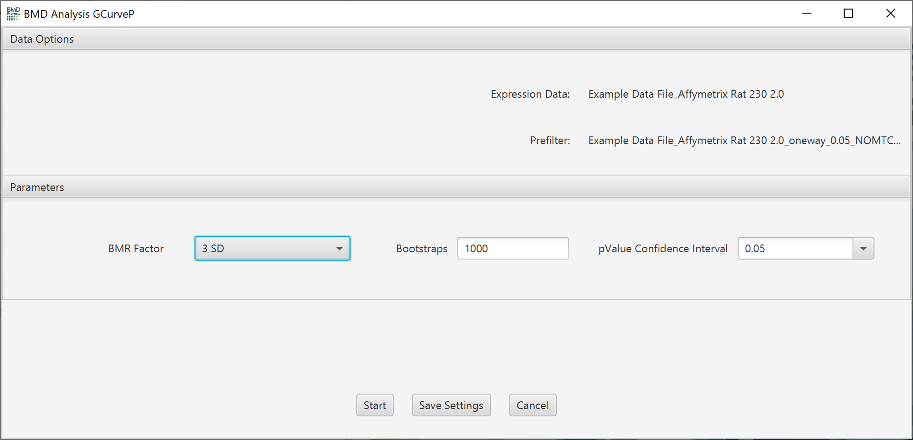

#### Data Options:

Lists expression data and any pre-filtering in the current workflow.

#### Parameters:

*BMR Factor* 
Also called the benchmark response or critical effect size. It is a multiple of standard deviation (SD) of the probe/gene expression change relative to its expression level at control. It determines the change in expression at which the BMD is defined. We recommend setting a BMR Factor to 3 when using GCurvep because it uses an adjusted standard deviation that down weights outlier values that leads to a compression of the estimated SD. GCurveP does not support the relative deviation BMR type.

*Bootstraps* 
Monotonicity correction is repeated by a bootstrap sampling algorithm. 1000 times is the default.

*pValue Confidence Interval* 
Default is 0.05, which means the software will calculate a 95% confidence interval

#### Multiple Threads:

*Number of Threads* 
Not yet implemented.

 

### Benchmark Dose Data Options (ToxicR Model Averaging)

When analyzing  data using ToxicR Model Averaging, the response variable is assumed to follow either a normal or log-normal distribution, with an option for the variance to be modeled as proportional to a power of the mean. The analysis incorporates prior information for the model parameters, which by default are based on the specifications for continuous data from [Wheeler et al. (2022)](https://pmc.ncbi.nlm.nih.gov/articles/PMC9799099/), but these can be customized by the user. A suite of continuous dose-response models (e.g., Hill, Exponential (3 and 5), Power) is then simultaneously fitted to the data using either a Laplace approximation or MCMC simulation. The final output, such as a benchmark dose (BMD), is not derived from a single best-fitting model; instead, it's a weighted average of the results from all models, with the weights determined by each model’s posterior probability. This approach formally integrates model uncertainty into the final estimate.

#### Data Options
Lists expression data and any pre-filtering in the current workflow.

#### Methods
Allows the user to select between between fitting methods, either Laplace approximation (ToxicR MAP/Laplace Bayesian MA) or MCMC simulation (ToxicR MAP/MCMC Bayesian MA).

#### Continuous Models
Allows user to select models they would like use to fit the data. The default is 4 models (listed below). These four allow for broad coverage of a variety dose-response shapes.

- **Power model:** `μ(dose)=γ+ β  dose^δ` where 0 < γ < 1, β ≥ 0, and 18 ≥ δ > 0.

- **Hill model:**   μ(dose)=γ+  (v dose^n)/(k^n+ dose^n )

- **Exponential 3:**   μ(dose)=a*exp⁡(sign* (b*dose)^d)

- **Exponential 5:**   μ(dose)=a*(c-(c-1)*exp⁡(-1* (b*dose)^d ))

- **Note:** ToxicR model averaging employs priors in the curve fitting process. Those priors are as follows: 

#### Parameters
- **BMR Type:** Standard deviation or relative deviation. A relative deviation BMR is a specific percentage change from the fitted value at control. In contrast, an SD-based BMR defines the response as a change from the fitted value at control that is equal to a multiple of the standard deviation of the model. 
- **BMR Factor:** Also called the benchmark response or critical effect size in some publications, the number of standard deviations at which the BMD is defined. The BMR is defined relative to the response at control. Since both the response at control and the standard deviation or relative deviation used to calculate the BMR are parameters estimated as part of the curve fit, the BMR may change when the model used to fit the data changes. With continuous data EPA recommends the use of a standard deviation BMR type with a BMR factor is 1 (equivalent to 1 standard deviation) when the critical effect size is unknown. In case of gene expression (i.e. [EPA ETAP standards](https://www.epa.gov/etap)) the recommended BMR factor is 1.349. In the case of relative deviation (equivalent to a modelled fold change) in the context of gene expression thresholds can vary but empirical assessment indicates a 25% (1.25 fold change) to 50% (1.5 fold change) generally provide reliable results that tend to have greater replicate study repeatability compared to standard deviation-based BMR values.
- **Variance:** Assumption of what the spread of the data is across different dose levels. A constant variance (homoscedasticity) assumption posits that the variability of the response is the same at all doses. In contrast, a non-constant variance (heteroscedasticity) assumption allows the variability to change as the dose increases, often being modeled as proportional to a power of the mean response. In the case of transcriptomic data most of the time it is log transformed to meet assumptions of common statistical tests, hence it homoscedastic (exhibits constant variance) in most cases. Options are constant or non-constant.
- **BMDU/L Estimation Method:** The Wald method first approximates the variance of the BMD estimate and then uses that variance to construct a confidence interval, typically assuming a normal distribution for the estimate. In contrast, the Profile Likelihood method does not rely on a single variance estimate but instead calculates the confidence limits by finding the range of BMD values for which the log-likelihood of the model does not fall too far below its maximum value. Options: Profile likelihood or Wald/Ewald Method. 
- **Step-Function Threshold:** This evaluates the fitted curve to determine if there is a percentage of overall change that takes place between 2 dose levels (i.e. it identifies the curves that exhibit rapid/large change between two adjacent dose levels). For example if the setting is 0.5 that would identify fits where 50% or more of the response occurs between 2 dose levels based on the fit of the model.  This identifies curves that are potentially biologically implausible, that said, use of this metric in subsequent analysis steps should be carefully considered particularly when a study employs broad dose spacing (e.g. 10-fold) or a limited number of dose levels (e.g.<=5).

#### Multiple Threads

- **Number of threads:** This option allows the user to perform multiple model fit computations in parallel by utilizing multiple CPU cores. The option increases the efficiency of CPU usage and significantly reduces the computational time. For example, a computer with a quad-core processor will theoretically require 1/4th the time to complete model fitting when 4 threads are selected rather than 1 thread. In practice, the actual efficiency varies. Try different values to optimize in your particular situation. Open a processor monitoring utility, and observe processor utilization. Typically, utilization of >80% can be achieved when setting the number of threads to be several to 10-fold greater than the number of processor cores. The default recommendation for the number of threads is 4 times the number of cores that are available, assuming that the user is employing the recommended 600 second model time out (see **Model Execution Timeout**). The recommendation is less than this if the user plans to carry out additional computational tasks while modeling is being performed.
    - *N.B. increasing processor utilization by BMDExpress will hinder interactive responsiveness.*
[Video describing Benchmark Dose Analysis results](https://www.youtube.com/watch?v=22pHEniAbKo&list=PLX2Rd5DjtiTeR84Z4wRSUmKYMoAbilZEc&index=9)

### Benchmark Dose Results
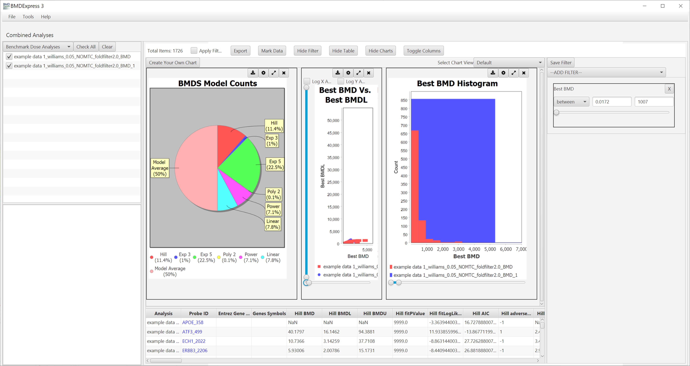

***Results are tabulated in the bottom half of the window.***

### Common Outputs (Across All Models)

  
Toggle carat to show/hide common outputs.

***Note that this section describes the results obtained for the Best model. For each individual model that has been used, BMDexpress provides an output column for each of the terms listed here. Within each model's subsection (directly following the Common Outputs section), we will discuss the outputs that are specific to a given model.***

- **Probe ID** — A unique identifier for a specific probe on the platform used for the transcriptomics experiment. This identifier allows a user to trace the BMD calculation back to a single, specific probe.
- **Entrez Gene IDs** — A unique and stable identifier for a gene, assigned by the National Center for Biotechnology Information (NCBI). Provides a non-ambiguous link to a wealth of public information about a gene's function and biological role, which helps in interpreting the toxicological significance of the BMD.
- **Genes Symbols**— These are the universally recognized, official, human-readable names for genes (e.g., TP53, BRCA1). They are crucial for connecting the statistical output to its biological meaning. By seeing which genes are affected, you can interpret the data in the context of known biological pathways and functions.
- **Best Model** — The name of the dose-response model that was selected as the best fit to the data. For the EPA BMDS models, the best model selection is based on either lowest AIC or Nested Chi Square, as specified by the user. For ToxicR Model Averaging, the "Model Average" is automatically selected as the best model. The model listed in this column is used for all "Best" calculations. Knowing which model was selected helps a user understand the shape of the dose-response curve. If no model can calculate a BMD (or BMDL/U does not converge), then "none" is listed as the best model.
- **Best BMD** — The Benchmark Dose value for the best-fitting model. This is the primary output of the analysis, providing a dose estimate for a specified BMR value (in standard deviation or relative deviation, selected by the user).
- **Best BMDL** — The lower limit of the 95% confidence interval around the Benchmark Dose for the best-fitting model. The confidence interval is calculated using either profile likelihood or Wald (Ewald) estimation, as specified by the user. The BMDL is a conservative estimate, providing a lower bound on the dose that could cause the benchmark response. It is often the primary value used for regulatory risk assessment.
- **Best BMDU** — The upper limit of the 95% confidence interval around the Benchmark Dose for the best-fitting model. The confidence interval is calculated using either profile likelihood or Wald (Ewald) estimation, as specified by the user. Provides an upper bound on the plausible BMD value.
- **Best fitPValue** — Global goodness of fit measure. Small p-values indicate that the model poorly fits the data. [More specifically, the model identified by AIC is further compared with the dose response from a fully saturated model (unconstrained model that is free from any functional form or trajectory constraints) using a conventional likelihood ratio test statistic. Smaller p-values indicate that the identified model does not fit the data as well as the saturated model; hence, it is possible to devise a better fitting model.] EPA ETAP  best practices recommended using a fitPValue greater than 0.1 to filter out poor fitting models. However, more recently, the R squared value introduced in BMDExpress3 is recommended by the NIEHS Division of Translation Toxicology (DTT) guidelines for assessing adequate model fits compared to the input (observed) data.
- **Best fitLogLikelihood** — The logarithm of the likelihood function for the best-fitting model. Log likelihood is a statistical measure that quantifies how well a model explains the observed data. The fitLogLikelihood is used in calculating the AIC. It is used in the comparisons of models; a higher value indicates a better-fitting model.
- **Best AIC** — The Akaike Information Criterion for the best-fitting model.  Given a set of dose-response models for a probe set/gene the AIC estimates the quality of each model relative to the other models. A lower AIC value indicates a better balance between model fit and model complexity. The best model is typically selected based on having the lowest AIC among all valid models.
- **Best adverseDirection** — Indicates the direction of the dose response trend predicted by the best-fitting model (positive for increasing expression, negative for decreasing expression). Provides crucial biological context for the BMD, informing whether the effect is a gene activation or suppression.
- **Best BMD/BMDL** — The ratio of the BMD to the corresponding lower 95% confidence limit of the BMD. A measure of the uncertainty in the BMD estimate. A value closer to 1 indicates less uncertainty and a more precise estimate. EPA ETAP guidelines use a threshold of 20 on this value as one of the criteria to obtain the significantly dose responsive probes [REFERENCE].  To be more stringent and have better control over the noise in the data one can decrease this threshold, for example to 10, which is currently done in the NIEHS DTT pipeline  .
- **Best BMDU/BMDL** — The ratio of the upper confidence limit to the lower confidence limit of the BMD estimate. Provides a measure of the total width of the 95% confidence interval, indicating the overall precision of the BMD estimate. When applied, typically a threshold of 40 is used on this value as one of the criteria to obtain the significantly dose responsive probes [REFERENCE].
- **Best BMDU/BMD** — The ratio of the upper confidence limit to the BMD. Another measure of uncertainty, providing insight into the upward range of potential BMD values. Like the Best BMD/BMDL, a threshold can be applied, however, in practice the lower end of the dose curve is generally of higher interest.
- **Best RSquared** — The R-squared value for the best-fitting model. Represents the proportion of the total variation in the data that is explained by the model. A value close to 1 indicates a good fit. Or in other words, the higher the R-squared value, the better the fit. R squared values greater than 0.6 are currently recommended by the NIEHS Division of Translation Toxicology (DTT) guidelines for assessing adequate model fits compared to the input (observed) data.
- **Best Is Step Function** — A flag (true/false) indicating whether the best-fitting model resembles  a step-function-like shape. Indicates a rapid increase/decrease in a small dose range, followed by a plateau. Should not be used with less than 5 doses. This is meant to weed out genes/probes that do not display a shape typically found in biology.
- **Best Is Step Function Less Than Lowest Dose** — A flag indicating whether the step function-like response (i.e. the rapid change) occurs at a dose below the lowest tested dose. Warns that the BMD may be less reliable because the effect occurs outside the dose range of the experiment.
- **Best Z-Score** — The Z-score for the best-fitting model. A measure of the statistical significance of the dose-response relationship. Calculated as the difference between the response at the maximum tested dose and the minimum tested dose, divided by the standard deviation. It provides a standardized measure of the response across the doses. Since it is normalized to a probe's variability, this value is useful for comparing the effect across different probes/genes. The Z-Score is positive for probes with increasing trends and negative for decreasing trends.
- **Best ABS Z-Score**: The absolute Z-score from the best-fitting model provides the magnitude of the Z-score without the direction.
- **Best Modelled Response BMR Multiples**: This value is the benchmark response (BMR) multiple from the single best-fitting model (i.e., the number of BMRs it takes to increase/decrease the baseline (control) response to the maximal response observed in the modeled curve). It indicates the size and direction of the modeled response over the entirety of the dose range based on multiples of the change in response at the BMD compared to the response at dose=0.
- **Best ABS Modelled Response BMR Multiples**: This value is the absolute benchmark response (BMR) multiple from the single best-fitting model. It indicates the size of the modeled response over the entirety of the dose range based on multiples of response at the BMD.
- **Best Model Fold Change**: A model-predicted value for the maximum effect observed in the experiment. This is the fold change (up or down) calculated at the y-axis value along the entirety of best fitting modelled response curve that is furthest from the y-axis predicted values for the controls (dose=0). It can be used as an alternative to the max fold change since the max fold change only considers pairwise comparisons of the input data between each dose group and control.
- **Best ABS Model Fold Change**: This is the absolute value of the Best Model Fold Change described above.
- **Best BMD/Low Dose** — The ratio of the BMD to the lowest dose tested in the experiment. Indicates whether the BMD falls within or outside of the tested dose range. A value less than 1 suggests the BMD is below the lowest dose in the study.
- **Best BMD/High Dose** — The ratio of the BMD to the highest dose tested in the experiment. Indicates whether the BMD falls within or outside of the tested dose range. A value less than 1 suggests the BMD is below the highest dose in the study. A value close to 1 indicates that the mathematical dose-response model is being heavily influenced by the high-dose results. A value greater than 1 indicates that the BMD is above the highest dose in the study.
- **Best BMD Response/Low Dose Response** — The ratio of the response at the BMD to the response at the lowest dose, as predicted by the best-fitting model. Response refers to the unlogged expression value predicted by the best model at a specific dose value along the curve (i.e. at the BMD and lowest dose). It helps a user understand where the BMD response falls relative to the response at the highest dose.
- **Best BMD Response/High Dose Response** — The ratio of the response at the BMD to the response at the highest dose, as predicted by the best-fitting model. It helps a user understand where the BMD response falls relative to the response at the highest dose.
- **Prefilter P-Value** and **Prefilter Adjusted P-Value**: These values come from a preliminary statistical test (e.g., ANOVA, Williams). For example: William's trend test is used to identify genes that show a monotonic increase/decrease in expression with increase in dose. The Prefilter P-Value can be used as an initial screen to determine which genes to feed into the complex BMD models. The adjusted p-value accounts for multiple testing, making it more reliable for identifying truly responsive genes. The p-values inform on which genes are plausibly dose-responsive and worth further consideration. If the Curve Fit prefilter was run, then the **Prefilter P-Value** will be the same as the results in the **Best fitPValue** column. Note that **Prefilter P-Value** and **Prefilter Adjusted P-Value** are legacy output columns that exist for historical expectations and backward compatibility. The new prefilter outputs, described next, are the more authoritative columns moving forward.
- **One-way ANOVA Prefilter P-Value** and **One-way ANOVA Prefilter Adjusted P-Value**: These values come from the ANOVA prefilter, only if it was run.
- **Williams Trend Test Prefilter P-Value** and **Williams Trend Test Prefilter Adjusted P-Value**: These values come from the Williams Trend Test prefilter, only if it was run.
- **Oriogen Trend Test Prefilter P-Value** and **Oriogen Trend Test Prefilter Adjusted P-Value**: These values come from the Oriogen prefilter, only if it was run.
- **CurveFit Prefilter Goodness of Fit**: This value is identical to the **Best fitPValue** and will be populated on if the Curve Fit prefilter was run.
- **Max Fold Change**: This value represents the **largest magnitude of change** in gene expression observed at any dose level in the experiment. It can be positive or negative.  It provides a quick snapshot of the maximum biological response in either direction. It can be used to quickly identify genes that show a strong up/down response, regardless of the dose at which it occurred.
- **Max Fold Change Absolute Value**: This is the absolute value of the `Max Fold Change`. It is best used for ranking genes based on the sheer magnitude of their response, without regard to whether the gene was up- or down-regulated. A threshold of 1.5 is often applied to focus on genes with a noticeable effect.
- **FC Dose Level 1, 2, 3, etc.**: These are the observed fold change values at each experimental dose level compared to control. They are best used to visualize the raw data and see how gene expression values change across the dose range before any modeling is applied.
- **NOTEL** and **LOTEL**: The **No-Observed-Effect Level (NOTEL)** is the highest dose with no statistically significant change. The **Lowest-Observed-Effect Level (LOTEL)** is the lowest dose with a significant change. These are traditional, non-modeled metrics that provide a simple dose-based summary of the response. These are calculated in the prefilter and carried through the analysis so they can be easily reviewed by the user. They are useful for an initial look at the data through a more traditional pair-wise lens.

***

### ToxicR (Model Averaging, and EPA BMDS) Specific Outputs

***Model* Execution Complete**: A flag indicating successful model fitting.
***Model* Parameter Sign**: Indicates the direction of the dose-response relationship for the model; direction of the effect on the probe.  
***Model* Residual  1, 2, 3, etc.**: The difference between the observed value and the value predicted by the model at a specific dose level. Examining the residuals at each dose level helps assess the quality of the model fit. Large residuals suggest a poor fit at that specific dose.

### Hill Model Specific Outputs

- **Hill Parameters**
    - **Intercept**: The baseline response at zero dose.
    - **v**: The maximum response, or asymptote, of the curve.
    - **n**: The Hill coefficient, which controls the **steepness** of the curve. A high value indicates a very steep, switch-like response.
    - **k**: The dose that produces a half-maximal response (EC50). These parameters are best used for a detailed understanding of the curve's shape and to compare the mechanisms of action for different chemicals.

***

### Power Model Specific Outputs

The Power model is a simpler model with a `power` parameter that allows for linear or non-linear relationships.

- **Power Parameter control, Power Parameter slope, Power Parameter power**: These are the model's parameters.
    - **control**: The baseline response at zero dose.
    - **slope**: The rate of response change.
    - **power**: The exponent that controls the curve's shape. A power of 1 is linear, while a power greater than 1 results in an accelerating curve. These are useful for understanding the mathematical form of the dose-response relationship.

***
### Polynomial Model Specific Outputs

- **Linear Parameters**
    - **beta_0**: The baseline response at zero dose.
    - **beta_1**: The slope, or rate of response change, of the curve.
- **Additional Poly Parameters**
    - **beta_2, 3, etc.**: Additional estimates for the betas up to the degree of the polynomial.

***

### Exponential Model 3 & 5 Specific Outputs

Exponential models are flexible and can handle more complex shapes, including U-shaped or inverted U-shaped responses.

- **Exp 5 Parameter a, b, c, d**: These are the parameters of the Exponential 5 model, which provides even greater flexibility in curve fitting than the Exp 3 model. These parameters are best utilized when standard models fail to provide a good fit.
- **Exp 3 Parameter sign, a, b, d**: These are the mathematical parameters of the Exponential 3 model, which control the direction, scale, rate, and steepness of the curve.

***
### Model Averaging (MA) Specific Outputs

- **MA Hill Posterior Probability**: The posterior probability of the Hill model in the Bayesian model averaging. This value represents the weight assigned to the Hill model based on how well it fits the data compared to other models. A higher probability indicates a stronger contribution of that model to the final model-averaged result.

- **MA Power Posterior Probability**: The posterior probability of the Power model in the Bayesian model averaging. This indicates the weight given to the Power model in the overall average.

- **MA Exp 3 Posterior Probability**: The posterior probability of the Exponential 3 model in the Bayesian model averaging. Indicates the weight given to the Exp 3 model.

- **MA Exp 5 Posterior Probability**: The posterior probability of the Exponential 5 model in the Bayesian model averaging. Indicates the weight given to the Exp 5 model.

***

### GCurveP Model Specific Outputs 
- **GCurveP BMD, GCurveP BMDL, GCurveP BMDU**: These are the core BMD estimates derived from the G-CurveP method. They represent the point of departure and its confidence bounds.

- **GCurveP BMR**: This is the specific Benchmark Response value used for the G-CurveP calculation. Unlike standard models, it is often expressed in terms of a biological change rather than a standard deviation.

- **GCurveP fitValue**: A metric used to assess the quality of the G-CurveP fit.

- **GCurveP BMD AUC, GCurveP BMDL AUC, GCurveP BMDU AUC**: These outputs provide a BMD based on the Area Under the Curve (AUC) of the dose-response plot. This is a unique feature of G-CurveP. The AUC is a holistic measure of the overall response magnitude across the dose range. A BMD based on AUC is useful for comparing the total impact of different chemicals.

- **GCurveP BMD wAUC, GCurveP BMDL wAUC, GCurveP BMDU wAUC**: The w indicates a weighted AUC, where the area is weighted by the dose. This gives more importance to responses at higher doses. These values are useful for understanding the dose-weighted impact.

- **GCurveP adverseDirection**: This indicates whether the G-CurveP fit predicts an overall up- or down-regulation of the gene.

- **GCurveP BMD/BMDL**: This is a precision metric for the G-CurveP BMD.

- **GCurveP Execution Complete**: A flag indicating if the model-fitting process was successful.

- **GCurveP Baseline**: The estimated baseline gene expression at zero dose.

- **GCurveP Weighted STD DEV**: The weighted standard deviation of the response, which provides a measure of the data's variability that the model accounts for.

- **GCurveP Is Step Function Less Than Lowest Dose**: A flag for non-ideal fits that show a sharp, step-like change below the lowest tested dose.

***

### Parameters Not Calculated with G-CurveP

- **Best Z-Score, Best Modelled Response BMR Multiples, Best BMD/Low Dose, Best BMD/High Dose, Best BMD Response/Low Dose Response, Best BMD Response/High Dose Response, Best Model Fold Change**: The G-CurveP method uses a different, non-parametric approach and does not produce these specific outputs. This is important to note for documentation, as it explains why certain columns are blank or flagged as "Not calculated."

***

#### Curve Viewer

Each probeset ID is a hyperlink to a separate window that displays a plot of the corresponding dose response behavior and model fit curves.

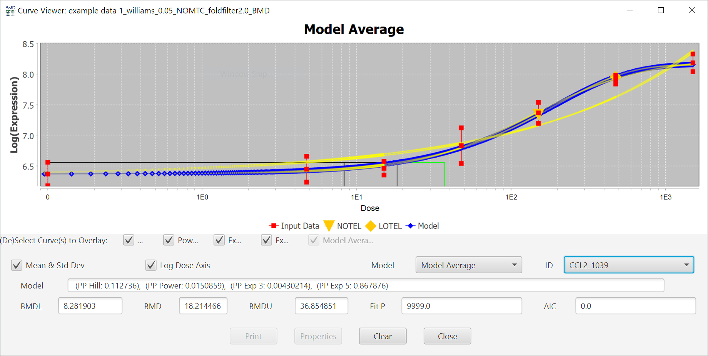
The curve that is shown initially is the one  with the best fit [as described in the introduction](Home#basic-workflow), but you can view the fit of other models by using the *Model* dropdown menu.

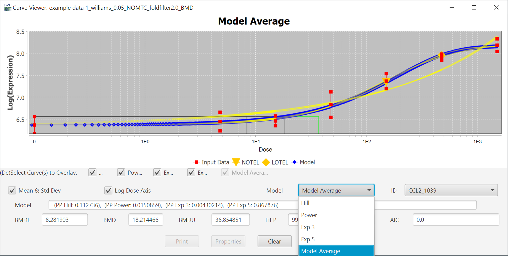

The *Mean & Standard Deviation* checkbox toggles the points in the plot to reflect the mean and standard deviation of each dose, or the response data points.

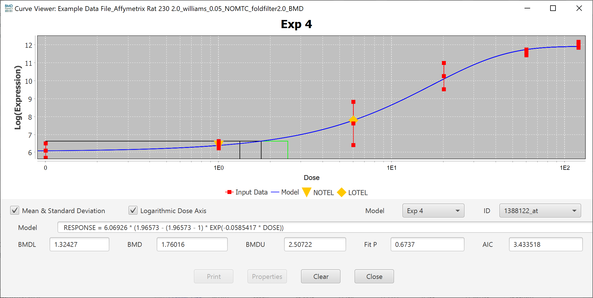

You can also change the scale of the axis to linear by unchecking the *Logarithmic Dose Axis* checkbox.

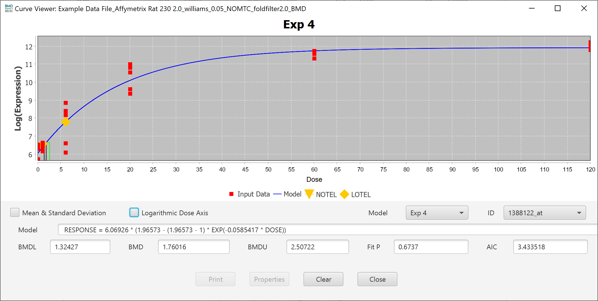

You can switch between different probes/probe sets inside of the individual curve viewer using the *ID* dropdown, however it is usually faster to close the popup and double-click on a different probe/probe set in the results table.

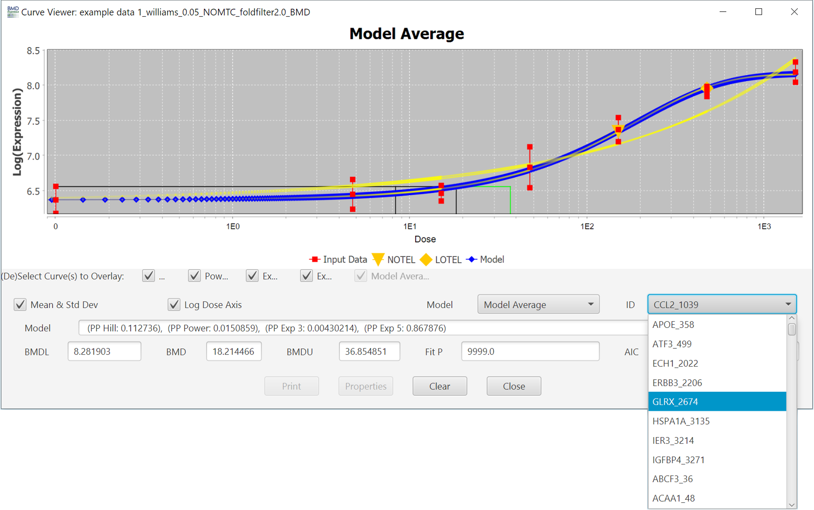

All properties of the curve can be altered in the *Properties Menu*, accessed by right-clicking in the chart area.

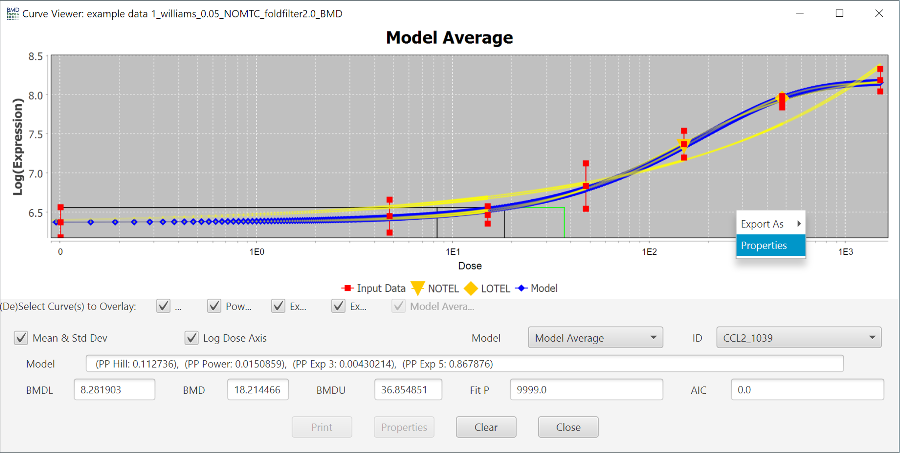

Inside the Chart Editor for the plot, there are a variety of parameters that can be changed to alter the appearance of the plot.

- **Title**
    - Show Title
    - Title Text
    - Font
    - Color
- **Plot**
    - Domain & Range Axis
        - Label
        - Font
        - Paint
    - Other
        - Ticks
            - Show tick labels
            - Tick label font
            - Show tick marks
        - Range
            - Auto-adjust range
            - Minimum range value
            - Maximum range value -TickUnit
            - Auto-selection of TickUnit
            - Tickunit Value
    - Appearance
        - Outline Stroke
        - Outline Paint
        - Background Paint
        - Orientation
- **Other**
    - Draw anti-aliased
    - Background paint
    - Series Paint
    - Series Stroke
    - Series Outline Paint
    - Series Outline Stroke

Finally, you export an image of the plot by right clicking on the image and selecting "Export As" and then selecting the image file format.

### Benchmark Dose Visualizations

The default visualizations are:

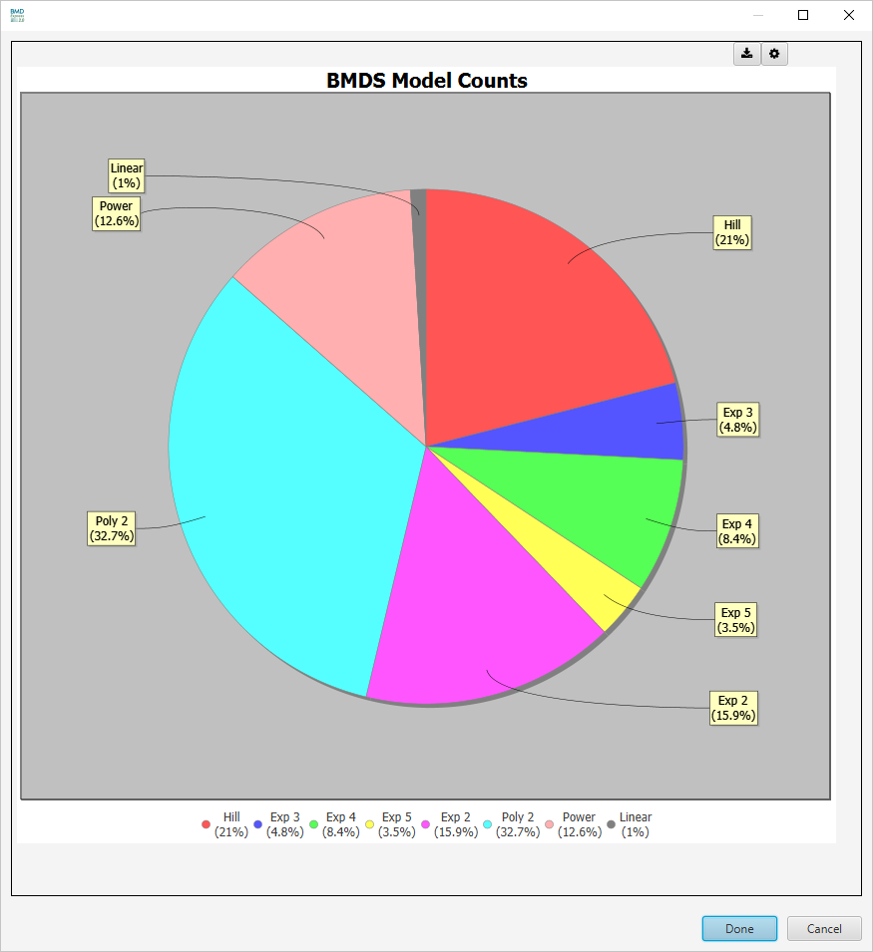

- **EPA BMDS Model Counts**

 

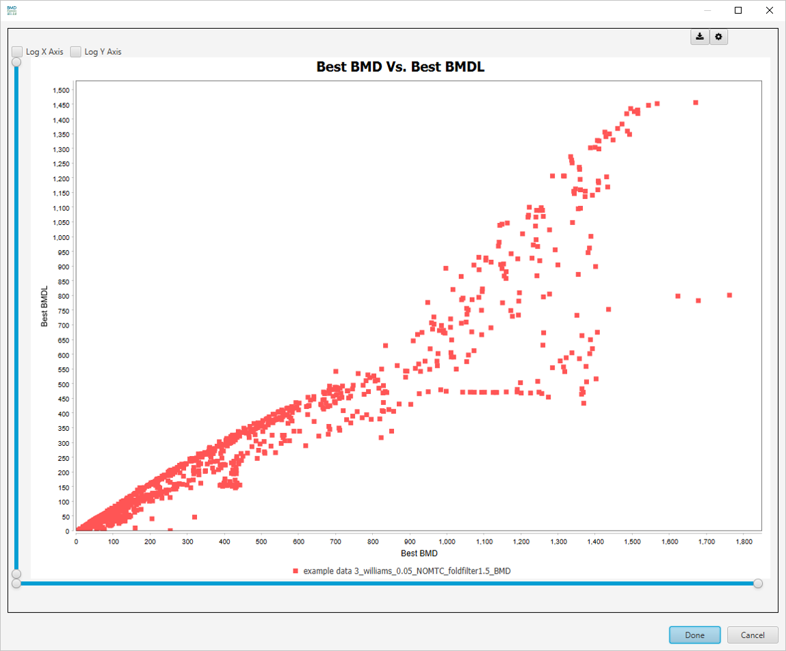

- **Best BMD Vs. Best BMDL**

 

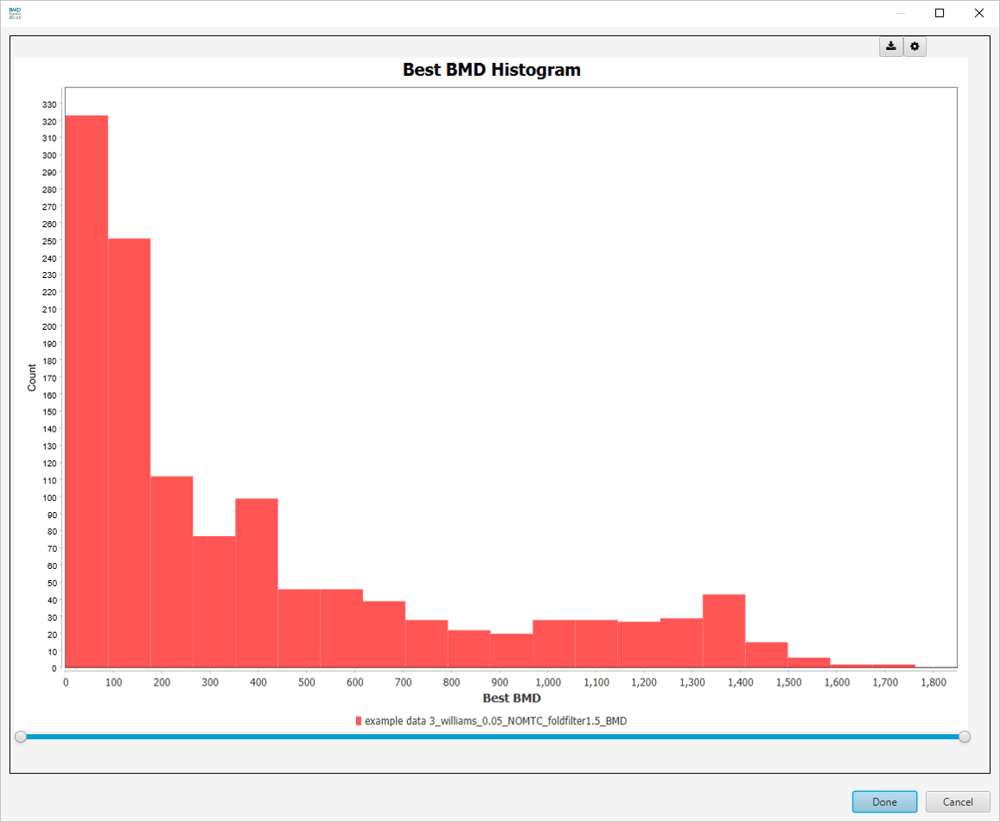

- **Best BMD Histogram**

 

Additional visualizations are available by making a selection in the `Select Graph View` dropdown list.

### Benchmark Dose Analysis Visualization Filters

These parameters are changed via the [filter panel](overview#filters-panel). You must also make sure that the `Apply Filter` box is checked in the [toggles panel](overview#toggles-panel) for these filters to be applied. The filters will be applied as soon as they are entered; there is no need to click any *apply* button other than the checkbox.

There is a filter available for every column in the BMD results table. Some particularly useful ones are:

- **Best BMD:** Filter by best BMD
- **Best BMD/BMDL:** Filter by BMD/BMDL ratio
- **Best BMDL:** Filter by best BMDL
- **Best BMDU:** Filter by best BMDU
- **Best BMDU/BMD:** Filter by BMDU/BMD ratio
- **Best BMDU/BMDL:** Filter by BMDU/BMDL ratio
- **Best Fit Log-Likelihood:** Filter by Log-Likelihood
- **Best Fit *P*-Value:** Filter by fit p-value
- **Gene ID:** Filter by gene IDs.
- **Gene Symbols:** Filter by gene symbols.

