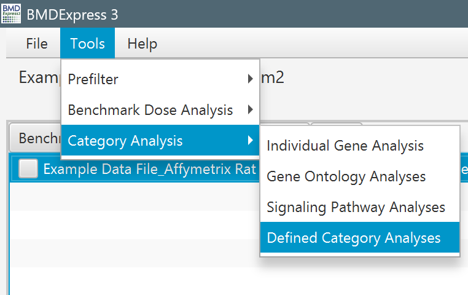
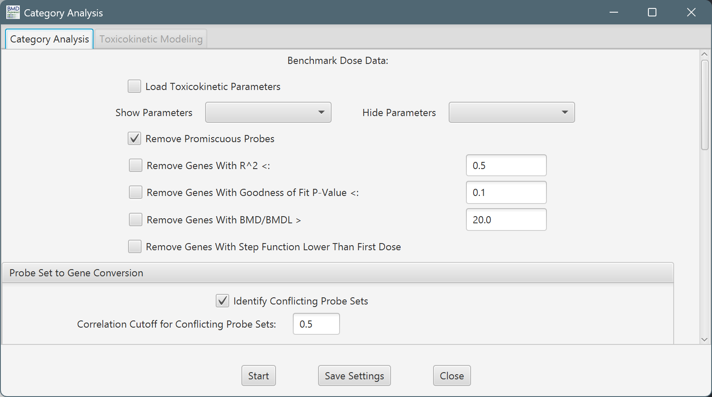
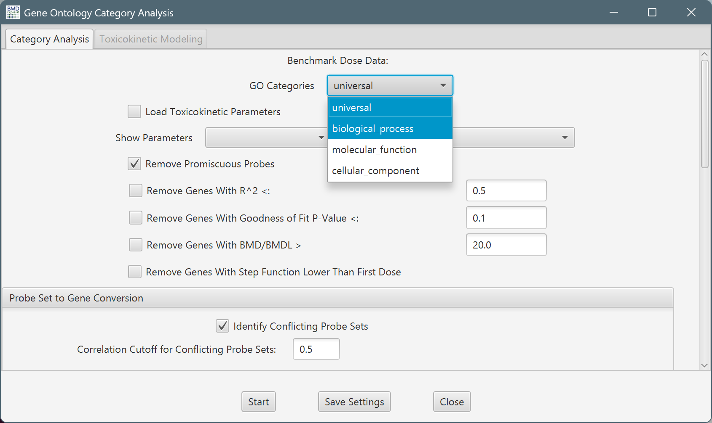
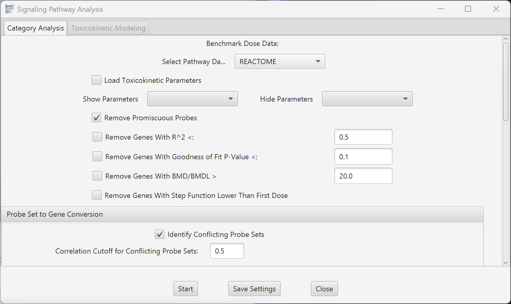
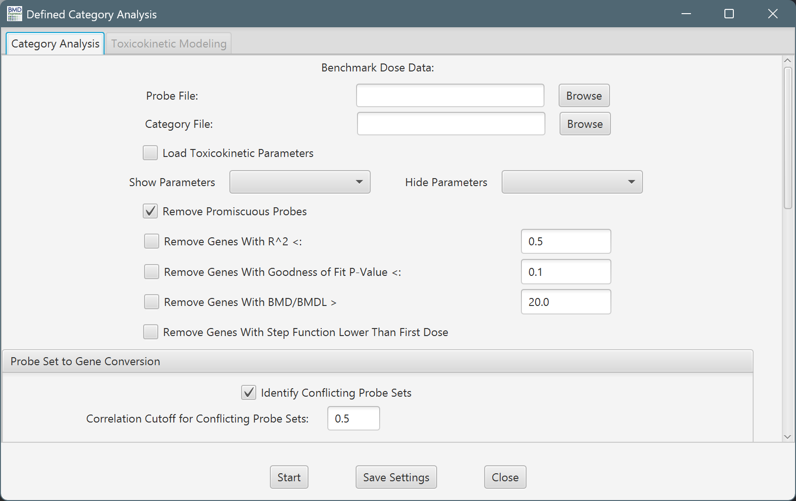
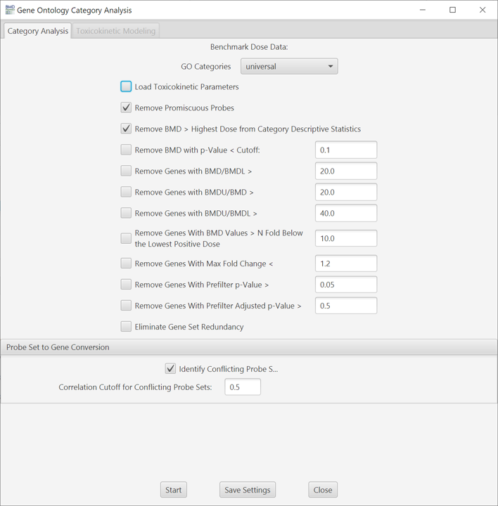
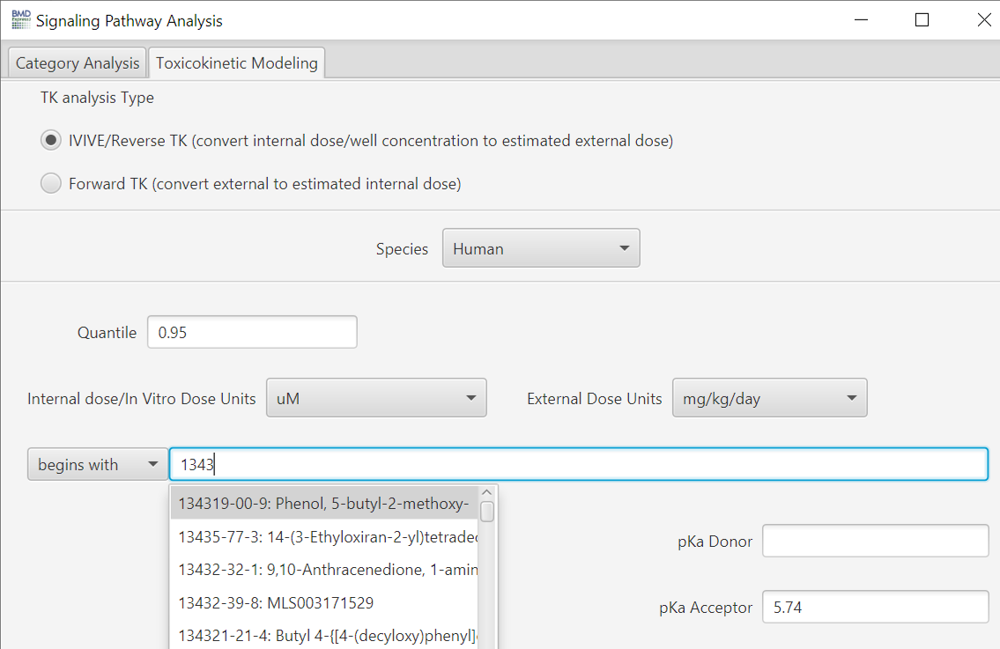
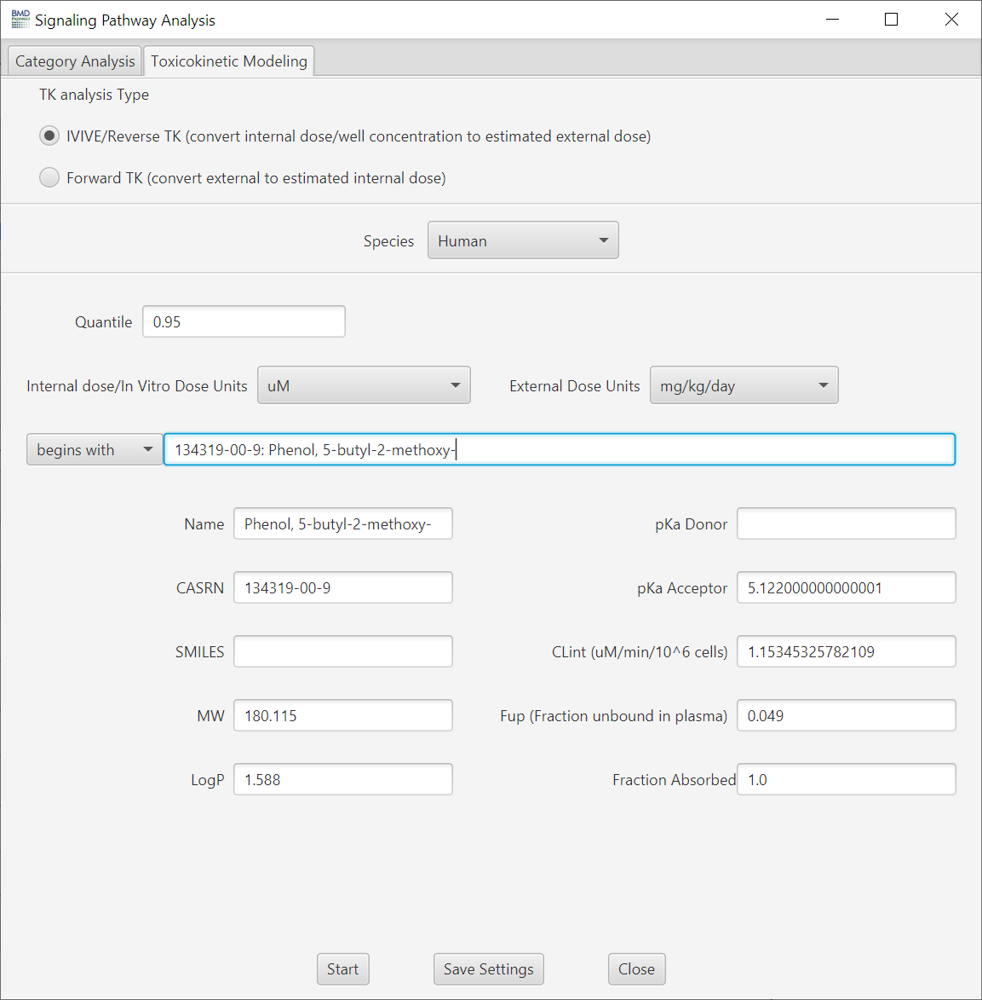
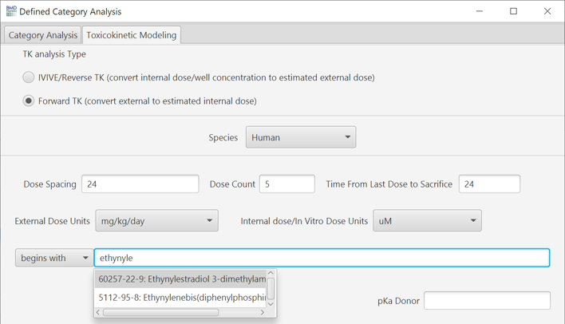
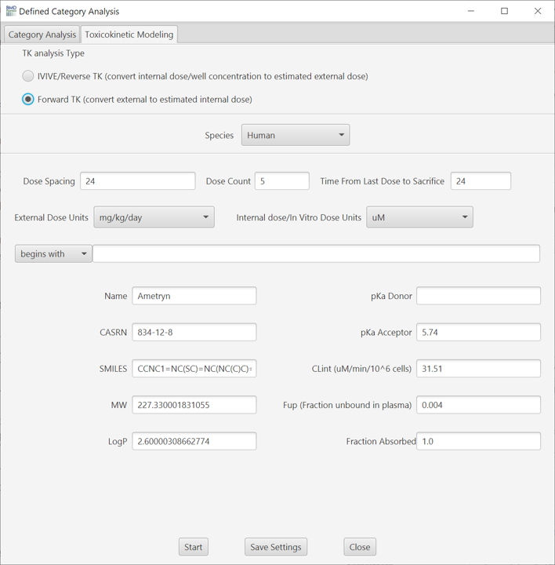

Functional Classifications
==========================

Introduction
------------

[Video demonstrating how to perform Functional Classification Analysis](https://www.youtube.com/watch?v=bsBQftLUWZs&index=10&list=PLX2Rd5DjtiTeR84Z4wRSUmKYMoAbilZEc&t=0s)

Benchmark dose (BMD) values are used as input for defined category analysis. Probeset identifiers are merged based on their NCBI Entrez Gene identifiers. When two or more probesets are associated with a single gene, the BMDs are averaged to obtain a single value corresponding to the Entrez ID. The Entrez IDs are then matched to various functional classifications. Included by default in BMDExpress 3 are:

<ul style="padding-left: 1.2em; margin-left: 0;">
  <li>Individual Gene Analysis</li>
  <li><a href="http://www.geneontology.org/">Gene Ontology</a>
    <ul style="padding-left: 1.5em;">
      <li>Universal</li>
      <li>Biological processes</li>
      <li>Molecular functions</li>
      <li>Cellular component</li>
    </ul>
  </li>
  <li>Signaling Pathway
    <ul style="padding-left: 1.5em;">
      <li><a href="http://www.reactome.org/">Reactome</a></li>
      <li><a href="https://tripod.nih.gov/bioplanet/">BioPlanet</a></li>
    </ul>
  </li>
  <li>Defined category
    <ul style="padding-left: 1.5em;">
      <li>User defined genes sets (e.g., signatures or proprietary pathway sets)</li>
    </ul>
  </li>
</ul>

Summary values representing the central tendencies and associated variability of the BMDs and benchmark dose lower and upper confidence limits (BMDL and BMDU) for the genes in each category are calculated. In the case of "Individual Gene Analysis", single genes are the category, providing averages over multiple probesets for a given gene.

Choose the desired BMD result set(s) in the Data Selection Area, and select either:

<code>Tools > Individual Gene Analysis</code> 
<code>Tools > Gene Ontology Analysis</code> 
<code>Tools > Signaling Pathway Analysis</code> 
<code>Tools > Defined Category Analysis</code>

 

### Functional Classification Categories

**Individual Gene:**
Uses the annotation associated with platform that was applied when the expression data loaded into the program

 

**Gene Ontology:**
Select the class of GO category for the analysis.

 

**Signaling Pathways:**
Select the signaling pathway (Reactome or BioPlanet) categories for the analysis.

 

**Defined Categories:**
Defined category analysis does functional classification with user-defined categories; e.g. proprietary databases of signaling pathways, disease annotations, or any other grouping of genes/annotations.

 

Defined category analyses require two tab-delimited input files from the user:
<ul style="padding-left: 1.2em; margin-left: 0;">
  <li><strong>Probe Map File</strong>: <em>(Must include at least two columns)</em>
    <ul style="padding-left: 1.5em;">
      <li>Probe set or probe identifiers</li>
      <li>Component identifiers (usually gene identifiers)</li>
      <li>Example <a href="assets/images/files/Probe-Map-File_Human_S1500_Probe-to-Entrez-Gene.txt">Probe Map File</a></li>
    </ul>
  </li>
  <li><strong>Category Map File</strong>: <em>(Must include at least three columns)</em>
    <ul style="padding-left: 1.5em;">
      <li>Category identifier: Unique Identifier of a pathway.</li>
      <li>Category name: Descriptive name of a pathway.</li>
      <li>Category component: Individual gene, only one per row.</li>
      <li>Example <a href="assets/images/files/Category-Map-File_MsigDB-Hallmark-Gene-Sets.txt">Category Map File</a></li>
    </ul>
  </li>
</ul>

### Functional Classification Setup

**Note:**
The setup screen for a Gene Ontology Analysis is shown here, but Individual Gene, Signaling Pathway and Defined Category Analysis use the same options below. The only difference is selecting which categories to use.

 

  
Toggle carat to show/hide Functional Classification setup options.

<ul style="padding-left: 1.2em; margin-left: 0;">
  <li><strong>Load Toxicokinetic Parameters:</strong> If your data is from an in vitro test system and you would like to convert the in vitro BMD values to *in vivo* oral equivalent doses, or if you would like to perform forward toxicokinetic modeling to estimate internal dose, then tick "Load Toxicokinetic Parameters". The "Toxicokinetic Modeling" tab will then become active.</li>
  <li><strong>Show Parameters:</strong> This dropdown menu allows additional filtering criteria to be enabled.</li>
  <li><strong>Hide Parameters:</strong> This dropdown menu allows the user to disable any of the additional filtering criteria that had been enabled from the Show Parameters menu.</li>
  <li><strong>Remove promiscuous probes:</strong> When selected probes that map to more than one gene are removed from the functional classification analysis</li>
  <li><strong>Remove Genes With R^2  < :</strong> Filter based on the Best RSquared value.</li>
  <li><strong>Remove Genes With Goodness of Fit P-Value <</strong> Remove probes/genes where the best model’s goodness-of-fit p-value is below the defined cutoff.</li>
  <li><strong>Remove Genes with BMD/BMDL ></strong> Filter based on the ratio of the BMD to the corresponding lower 95% confidence limit of the BMD.</li>
  <li><strong>Remove Genes With BMDU/BMD ></strong> Filter based on ratio of the upper confidence limit to the BMD.</li>
  <li><strong>Remove Genes With BMDU/BMDL ></strong> Filter based on the ratio of the upper confidence limit to the lower confidence limit of the BMD estimate.</li>
  <li><strong>Remove Genes With BMD Values > N Fold Below the Lowest Positive Dose</strong> Filter out unrealistically small BMDs.</li>
  <li><strong>Remove Genes With |Max Fold Change| <</strong> Allows for filtering of probes based on fold change if the prefilter was run at a higher threshold. The value that is filtered on can be found in the column labeled data table in the Benchmark Dose Analysis Section entitled "Max Fold Change Absolute Value". NOTE: If a prefilter was applied previously in the analysis workflow which removed probes, the probes can not be restored by using a lower threshold at this step.</li>
  <li><strong>Remove Genes With Adverse Direction</strong> UP or DOWN can be selected to remove increasing or decreasing genes from the analysis.</li>
  <li><strong>Remove Genes with Anova Prefilter p-value ></strong> Allows for filtering of probes based on the ANOVA prefilter p-value if the prefilter was run at a lower threshold. NOTE: If the prefilter was applied previously in the analysis workflow which removed probes, the probes can not be restored by using a higher threshold at this step.</li>
  <li><strong>Remove Genes with Anova Prefilter Adjusted p-value ></strong> Allows for filtering of probes based on the ANOVA adjusted prefilter p-value if the prefilter was run at a lower threshold. NOTE: If the prefilter was applied previously in the analysis workflow which removed probes, the probes can not be restored by using a higher threshold at this step.</li>
  <li><strong>Remove Genes with Williams Prefilter p-value ></strong> Allows for filtering of probes based on the Williams Trend Test prefilter p-value if the prefilter was run at a lower threshold. NOTE: If the prefilter was applied previously in the analysis workflow which removed probes, the probes can not be restored by using a higher threshold at this step.</li>
  <li><strong>Remove Genes with Williams Prefilter Adjusted p-value ></strong> Allows for filtering of probes based on the Williams Trend Test adjusted prefilter p-value if the prefilter was run at a lower threshold</li>NOTE: If the prefilter was applied previously in the analysis workflow which removed probes, the probes can not be restored by using a higher threshold at this step</li>
<li><strong>Remove Genes with Oriogen Prefilter p-value ></strong> Allows for filtering of probes based on the Oriogen prefilter p-value if the prefilter was run at a lower threshold</li>NOTE: If the prefilter was applied previously in the analysis workflow which removed probes, the probes can not be restored by using a higher threshold at this step</li>
<li><strong>Remove Genes with Oriogen Prefilter Adjusted p-value ></strong> Allows for filtering of probes based on the Oriogen adjusted prefilter p-value if the prefilter was run at a lower threshold</li>NOTE: If the prefilter was applied previously in the analysis workflow which removed probes, the probes can not be restored by using a higher threshold at this step</li>
<li><strong>Remove Genes With |Z-Score| <</strong> Allows for filtering of probes based on the absolute Z-score</li>
<li><strong>Remove Genes With Step Function Detected</strong> When selected, genes are not included if they were flagged for having a step function-like response (i.e.the rapid change).</li>
<li><strong>Remove Genes With Step Function Lower Than First Dose</strong> When selected, genes are not included if they were flagged for having a step function-like response (i.e. the rapid change) that occurs at a dose below the lowest tested dose.</li>
<li><strong>Remove Genes With |Model Fold Change| <</strong> Allows for filtering of probes based on the model-predicted value for the maximum effect observed in the experiment.
<li><strong>Remove Genes With BMD > Highest Dose from Category Descriptive Statistics</strong> Remove probesets/features where the BMD is greater than the highest dose</li>Removing these probesets/features removes BMDS that are based on extrapolation beyond the measured dose range</li>
<li><strong>Min # of Genes in Gene Set</strong> Allows for a minimum number of genes to be required per gene set/category for it to be included in the analysis.
<li><strong>Max # of Genes in Gene Set</strong> Allows for a maximum number of genes that a gene set/category can have for it to be included in the analysis.
  <li><strong>Eliminate Gene Set Redundancy:</strong> Identifies gene sets in the Functional Classification that are identically populated with genes from the experiment. This is common with GO terms and large pathway gene sets. If the gene sets are GO terms that are curated in the software and mapped to the platform (via the annotations) then this function first identifies which of the gene sets is more populated based on the "Percentage" populated. If the gene sets are still not differentiated then the gene set with the highest GO level (most specific) is selected. If there is still no differentiation between the gene sets then remaining identically populated gene sets are reported. In the case of Signaling Pathway Analysis and Defined Category Analysis only "Percentage" populated is considered and if differentiation is not possible then remaining identically the populated gene sets are reported.</li>
  <li><strong>Minimum Recommended Settings:</strong> It is recommended that the user employ "Remove Genes with BMD with Goodness of Fit P-Value < Cutoff: <strong>0.1</strong>" and "Remove Genes with BMDU/BMDL >: <strong>40</strong>" when running a Functional Classification. Depending on how the Prefilter step was performed the user may want to apply additional filtering for fold change and/or prefilter p-value to remove probes/genes not demonstrating significant change and/or effect size.</li>
  <li><strong>Feature (Probeset/Probe) to Gene Conversion</strong>
    <ul style="padding-left: 1.5em;">
      <li><strong>Multiple features mapping to the same gene:</strong> Functional classification analyses are inherently gene-based while microarrays or other gene expression technology are based on probesets or probes (aka, features). In most cases there is only one probe or probe set per gene. In some cases, due to alternative splicing or annotation differences multiple features (probes/probesets) representing the same gene are incorporated into a gene expression platform. When this occurs the software determines the average of the BMD, BMDL and BMDU values of the multiple features and assigns those values to the gene (identical to averaging for Individual Gene Analysis).</li>
      <li><strong>Identify Conflicting features:</strong> Due to either biological or technical reasons, it is possible that the expression levels of the different probesets or probes that map to the same gene conflict. To identify genes with potentially conflicting probesets or probes, the user must check the <em>Identify Conflicting Probesets</em> box and input a minimum correlation cutoff. Correlation coefficients are calculated between all probe sets or probes associated with a specific gene across the different doses.</li>
      <li><strong>Correlation cutoff for conflicting features:</strong> Genes with probe sets or probes not matching the minimum correlation cutoff are identified in the output.</li>
    </ul>
  </li>
</ul>

### Toxicokinetic Analysis
BMDExpress provides a toxicokinetic workflow based on a pure java implementation of EPA's [HTTK R-package v1.8](https://cran.r-project.org/web/packages/httk/index.html) without the need for the user to perform additional work.

Switch on TK calculation by ticking "Load Toxicokinetic Parameters".
### *In Vitro In Vivo* Extrapolation (IVIVE)/Reverse TK

[Video demonstrating how to perform IVIVE analysis](https://youtu.be/0TrTMHz0OOY)

The IVIVE feature provides a conversion of the user’s in vitro concentration data (or what can be thought of as blood levels at steady state, Css) to an oral daily dose equivalent (or what can be thought of as an external dose). The oral daily dose equivalent allows for the direct comparison of in vitro experimental data to in vivo exposures (i.e. external dose levels) of interest (e.g., estimated or allowable intake levels). Specifically, BMDExpress provides an IVIVE workflow based on a pure java implementation of EPA's [HTTK R-package v1.8](https://cran.r-project.org/web/packages/httk/index.html) directly and without the need for the user to perform additional work.

BMDExpress IVIVE models the 3 compartment steady-state model from HTTK v1.8, and calculates the [oral equivalent](https://www.rdocumentation.org/packages/httk/versions/1.8/topics/calc_mc_oral_equiv) for the summary fields of the category analysis results. Oral equivalent refers to the oral dose in humans that would produce the BMD(x) result.

The [HTTK R-package contains many options](https://www.jstatsoft.org/article/view/v079i04) to estimate equivalent doses. Within BMDExpress, the IVIVE oral equivalent doses are calculated using [calc_mc_oral_equiv](https://www.rdocumentation.org/packages/httk/versions/1.8/topics/calc_mc_oral_equiv) and the 3 compartment steady-state model. This model estimates the constant administered oral equivalent dose per day that would lead to steady state concentration (Css) in blood equivalent to benchmark dose estimated for a pathway or gene from the in vitro data. Important general HTTK model assumptions include: 100% bioavailability, and chemical leaves the body either by passive glomerular filtration or metabolism (changed into a metabolite). Default values for input parameters are used, with the exception of those provided by the user:

  
Toggle carat to show/hide input parameters.

<ul style="padding-left: 1.2em; margin-left: 0;">
  <li><strong>MW:</strong> molecular weight (g/mol)</li>
  <li><strong>LogP:</strong> lipophilicity</li>
  <li><strong>pKa Donor:</strong> pH(s) at which hydrogen acceptor sites (if any) are at equilibrium</li>
  <li><strong>pKa Acceptor:</strong> pH(s) at which hydrogne donor sites (if any) are at equilibrium</li>
  <li><strong>CLint:</strong> instrinsic metabolic clearance (µL/min/10^6 hepatocytes)</li>
  <li><strong>FUp:</strong> fraction of chemical free (i.e., unbound) in the presence of plasma</li>
  <li><strong>Dose Units:</strong> in vitro concentration units (µM, nM, pM)</li>
  <li><strong>Output units:</strong> desired output units (mg/kg/day or mmol/kg/day)</li>
  <li><strong>Quantile:</strong> desired concentration quantile to sample (between 0-1). Note that 95th concentration quantile is the same population as the 5th dose quantile. For more protective estimates, this parameter is by default to the 0.95 quantile</li>
  <li><strong>Species:</strong> species desired for the oral equivalent estimation (human, rat, rabbit, dog, mouse)</li>
</ul>

 

BMDExpress carries with it an embedded database of chemical identifiers, with properties (MW, LogP, pKa Donor, pKa Acceptor, CLint, FUp). It is derived from the default table provided by the [HTTK package](https://www.rdocumentation.org/packages/httk/versions/1.8), [Sipes et al. 2017](http://footnote), and [ICE 2.0 OPERA](http://reference).

To perform an IVIVE analysis, first confirm that IVIVE analysis is appropriate; that the data is from an *in vitro* experiment. On the Toxicokinetic Modeling tab, select TK analysis Type, "IVIVE/Reverse TK", and type a chemical name and/or CAS# into the search box. If the database contains a match, the remainder of the form will be filled with database values. with that chemicals properties and auto populate input fields that will then be passed to the calc_mc_oral_equiv function and used to calculate the in-vivo oral equivalent.

<table border="0">
<tr valign="top">
<td></td>
<td></td>
</tr>
</table>

### Forward Toxicokinetics

[Video demonstrating how to perform Forward TK analysis](https://youtu.be)

The Forward TK (FTK) feature provides the ability to estimate the blood level (internal dose) of an externally dose of a chemical (e.g. a BMD value based on and external dose measured in units of mg/kg/day). The forward toxicokinetic calculations for maximum concentration (Cmax) use the exact solution of the equations of the one-compartment model that is used in the ‘httk’ R package (Pearce et al. 2017). The solution assumes that doses are each of the same amount and are administered as a gavage dose at fixed intervals. Parameters required for the calculation are 1) effective dose (D), 2) number of times the dose is administered (n), 3) interval between times of administration of doses (S, units h), 4) volume of distribution (Vd), 5) rate of absorption from the gut (kg, units h-1), 6) rate of elimination from the body compartment (ke, units h-1), and 7) time at end of experiment (tfinal, h, measured from the time of the first dose). The effective dose may be different from the actual administered dose because of adjustment for bioavailability.

[A more detailed explanation of the FTK method. ](assets/images/files/ForwardTK.pdf)

  
Toggle carat to show/hide required parameters.

<ul style="padding-left: 1.2em; margin-left: 0;">
  <li>effective dose (D)</li>
  <li>number of times the dose is administered (n)</li>
  <li>interval between times of administration of doses (S, units h)</li>
  <li>volume of distribution (Vd)</li>
  <li>rate of absorption from the gut (kg, units h-1)</li>
  <li>rate of elimination from the body compartment (ke, units h-1)</li>
  <li>time at end of experiment (tfinal, h, measured from the time of the first dose)</li>
</ul>

 

To perform a forward toxicokinetic analysis, first confirm that FTK analysis is appropriate; that the data is from an *in vivo* experiment. Then, tick the box labeled "Load Toxicokinetic Parameters". The "Toxicokinetic Modeling" tab will then become enabled. On the Toxicokinetic Modeling tab, select TK analysis type, "Forward TK", and type a chemical name and/or CAS# into the search box. If the database contains a match, the remainder of the form will be filled with values database included with BMDExpress. with that chemicals properties and auto populate input fields that will then be passed to the one compartment model and used to calculate the estimated internal dose cMax.

<table border="0">
<tr valign="top">
<td></td>
<td></td>
</tr>
</table>

**Order of precedence for retrieving a chemical’s properties from the embedded DB:**  
For a given chemical and a given property we first look for the property value in the default HTTK package’s table.  If the property is not there, we look for the property value in the Sipes et al. 2017 table, and finally if the property value is not in the Sipes paper, we retrieve it from ICE 2.0 OPERA predictions table.

The user has the option to override any or all parameters via manual entry into the text fields. If a chemical is not present in the database, values must be entered manually.

For FTK BMDExpress employs a one compartment model, which assumes constant oral infusion and 100% absorbtion, and calculates the oral equivalent for the [summary fields of the category analysis results](#ivive-3-compartment-model-output).

### Functional Classification Results

[Video describing functional classification results](https://www.youtube.com/watch?v=2SJaGNVzQ-8&list=PLX2Rd5DjtiTeR84Z4wRSUmKYMoAbilZEc&index=11)

The tabular output from functional classification analysis consists of an identifier together with selected descriptors and summary values for each of the categories.

  
Toggle carat to show/hide functional classification results.

BMD Express 3's **Functional Classification** tool is a powerful results interpretation feature. It moves beyond individual gene analysis to examine dose-response relationships at a higher level, focusing on **gene sets** rather than single genes. The core idea is to see if a group of genes that share a common function (e.g., a biological process, a signaling pathway) shows a collective response to a chemical exposure. This is called **enrichment analysis**.

The tool first partitions all responsive genes into predefined classes. It then runs a **Fisher's Exact Test** to see if a particular class is **significantly enriched** with responsive genes. Finally, it provides summary statistics for the BMD values of all the genes within that enriched class, giving you a comprehensive picture of the toxicity at a functional level. 

***

### 1. GO, Pathway, and Gene Classification

These three classification types are all very similar in their output parameters, but they differ in the gene sets they analyze.

<ul style="padding-left: 1.2em; margin-left: 0;">
  <li><strong>GO (Gene Ontology)</strong>: The Gene Ontology is a widely used classification system for gene products. It organizes genes into a hierarchical structure based on their <strong>Molecular Function</strong>, <strong>Biological Process</strong>, and <strong>Cellular Component</strong>. Analyzing BMDs by GO term helps you understand if a specific biological process, like "oxidative stress" or "apoptosis," is sensitive to the chemical.</li>
  <li><strong>Pathway</strong>: This option groups genes into known biological pathways, such as those from the <strong>KEGG</strong> or <strong>Reactome</strong> databases. This is useful for identifying if a particular signaling cascade, metabolic pathway, or disease-related pathway is being affected by the exposure.</li>
  <li><strong>Gene</strong>: This is a unique classification where each individual gene is its own "class." It's essentially a way to run the BMD analysis for individual genes within the functional classification framework. The outputs will be similar to the main BMD analysis, but presented in a summary format.</li>
</ul>

***

### 2. Common Outputs (Shared Across All Classification Types)

<ul style="padding-left: 1.2em; margin-left: 0;">
  <li><strong>GO/Pathway/Gene Set/Gene ID and Name</strong>: These are the identifiers and names of the functional class being analyzed (e.g., a specific GO term or a KEGG pathway name).</li>
  <li><strong>GO Level</strong>: This output is specific to <strong>GO</strong> analysis and indicates the hierarchical level of the GO term. Lower levels are more specific, while higher levels are broader.</li>
  <li><strong>All Genes (Expression Data)</strong> and <strong>All Genes (Platform)</strong>: These values represent the total number of genes in the original expression dataset and on the microarray platform. They provide context for the size of the gene universe.</li>
  <li><strong>Input Genes</strong>: The total number of genes that passed the prefilter step and were used for the BMD analysis.</li>
  <li><strong>Genes with BMD <= Highest Dose</strong> and <strong>Genes with BMD/BMDL <= X</strong>: These are user-defined filters used to select only the most relevant genes. The first filters for genes with a BMD within the tested dose range, and the second filters for genes with a high-precision BMD.</li>
  <li><strong>Genes That Passed All Filters</strong>: The number of genes in the current class that met all the filtering criteria.</li>
  <li><strong>Fisher's A, B, C, D Parameters</strong>: These are the four numbers from the <strong>Fisher's Exact Test contingency table</strong>. They are crucial for understanding the enrichment of the gene set.
    <ul style="padding-left: 1.5em;">
      <li><strong>A</strong>: The number of genes in the class that passed the filters.</li>
      <li><strong>B</strong>: The number of genes not in the class that passed the filters.</li>
      <li><strong>C</strong>: The number of genes in the class that did not pass the filters.</li>
      <li><strong>D</strong>: The number of genes not in the class that did not pass the filters.</li>
    </ul>
  </li>
  <li><strong>Fisher's Exact Left, Right, Two Tail P-Value</strong>: These are the results of the Fisher's Exact Test. The <strong>two-tail p-value</strong> is the most common and indicates if the class is significantly enriched with responsive genes. A low p-value (e.g., < 0.05) suggests a significant enrichment.</li>
  <li><strong>Percentage</strong>: The percentage of genes in the class that passed the filters.</li>
  <li><strong>Entrez Gene IDs, Gene Symbols, Probe IDs</strong>: Lists of the identifiers for all the genes included in the current functional class.</li>
  <li><strong>Genes with Conflicting Probesets</strong>: The number of genes where multiple probesets on the microarray gave conflicting results (e.g., one was up-regulated and another was down-regulated).</li>
  <li><strong>BMD/BMDL/BMDU Mean, Median, Minimum, Standard Deviation, wMean, wSD</strong>: These are the summary statistics for the BMD, BMDL, and BMDU values of all the genes within the functional class. The mean and median provide a central tendency, while the standard deviation gives a measure of spread. The <strong>wMean</strong> (weighted mean) and <strong>wSD</strong> (weighted standard deviation) are weighted by the quality of the model fit. These values provide a single, representative point of departure for the entire functional group. The <strong>minimum</strong> values are often of interest for identifying the most sensitive genes within a class. In the case of individual gene analysis the BMD/BMDL/BMDU values (i.e., Mean, Median, Minimum) represent an average of the probes that pass all filtering criteria and correspond to a gene. If a probe is does not meet filtering criteria it is not considered in determination of the BMD/BMDL/BMDU values (i.e., Mean, Median, Minimum).</li>
  <li><strong>Percentile Index, BMD/BMDL/BMDU at 5th and 10th Percentile</strong>: These values identify the BMDs at the 5th and 10th percentiles for all genes in the analysis, or for genes within a specific class. They represent the BMDs of the most sensitive genes and are often used as a more conservative point of departure for risk assessment. In the case of individual gene analysis the values in these columns represent an average of the probes that pass all filtering criteria and correspond to a gene. In the case of individual gene analysis the BMD/BMDL/BMDU at 5th and 10th Percentile represent an average of the probes that pass all filtering criteria and correspond to a gene.</li>
  <li><strong>BMD/BMDL/BMDU List</strong>: A list of all the individual BMD values for the genes in the functional class.</li>
  <li><strong>Probes with Adverse Direction Up/Down, Genes with Adverse Direction Up/Down</strong>: The number of probes and genes that are either up- or down-regulated. This helps you understand the overall direction of the biological effect.</li>
  <li><strong>Genes Up/Down Lists and Probes Lists</strong>: Lists of the identifiers for genes and probes that are either up- or down-regulated.</li>
  <li><strong>Genes Up/Down BMD/BMDL/BMDU Mean, Median, SD</strong>: Summary statistics for BMD, BMDL, and BMDU values, broken down by the direction of regulation. This allows you to see if up-regulated genes are, on average, more or less sensitive than down-regulated genes.</li>
  <li><strong>BMD/BMDL/BMDU list (up/down)</strong>: Lists of the individual BMD values, broken down by direction.</li>
  <li><strong>Genes with Adverse Conflict Count, Genes Conflict List</strong>: The number of genes with a conflicting direction of regulation (e.g., some probes are up, others are down).</li>
  <li><strong>Model Counts</strong>: A tally of how many times each type of BMD model (e.g., Hill, Power) was the best-fitting model for the genes in this class.</li>
  <li><strong>Mean, Median, Min, Max, Standard Deviation Fold Change</strong>: Summary statistics for the fold change values of the genes in the class.</li>
  <li><strong>Confidence Intervals for BMD/BMDL/BMDU</strong>: These values provide a confidence range for the mean BMD, BMDL, and BMDU values for the entire gene set, offering a measure of uncertainty for the group-level summary.</li>
  <li><strong>Overall Direction, Percent Genes With Overall Direction Up/Down/Conflict</strong>: These metrics provide a high-level summary of the most prevalent direction of regulation within the class.</li>
  <li><strong>Genes with BMD RSquared >= X</strong>: The number of genes in the class whose best-fitting model had an R-squared value above a user-defined threshold. This is a quality control filter.</li>
  <li><strong>Min/Median/Max/Mean Model Fold Change</strong>: Summary statistics for the modeled fold change values at the BMD.</li>
  <li><strong>Min/Median/Max/Mean Z-Score</strong>: Summary statistics for the Z-scores, indicating the standardized magnitude of response for the group.</li>
</ul>

 

  
Toggle carat to show/hide IVIVE results.

<ul style="padding-left: 1.2em; margin-left: 0;">
  <li><strong>Oral Equivalent BMD Mean:</strong> Oral equivalent dose corresponding to the mean benchmark dose (BMD) for the genes in the category.</li>
  <li><strong>Oral Equivalent BMDL Mean:</strong> Oral equivalent dose corresponding to the mean benchmark dose lower confidence limit (BMDL) for the genes in the category.</li>
  <li><strong>Oral Equivalent BMDU Mean:</strong> Oral equivalent dose corresponding to the mean benchmark dose upper confidence limit (BMDU) for the genes in the category.</li>
  <li><strong>Oral Equivalent BMD Median:</strong> Oral equivalent dose corresponding to the median benchmark dose (BMD) for the genes in the category.</li>
  <li><strong>Oral Equivalent BMDL Median:</strong> Oral equivalent dose corresponding to the median benchmark dose lower confidence limit (BMDL) for the genes in the category.</li>
  <li><strong>Oral Equivalent BMDU Median:</strong> Oral equivalent dose corresponding to the median benchmark dose upper confidence limit (BMDU) for the genes in the category.</li>
  <li><strong>Oral Equivalent BMD Minimum:</strong> Oral equivalent dose corresponding to the minimum benchmark dose (BMD) for the genes in the category.</li>
  <li><strong>Oral Equivalent BMDL Minimum:</strong> Oral equivalent dose corresponding to the minimum benchmark dose lower confidence limit (BMDL) for the genes in the category.</li>
  <li><strong>Oral Equivalent BMDU Minimum:</strong> Oral equivalent dose corresponding to the minimum benchmark dose upper confidence limit (BMDU) for the genes in the category.</li>
  <li><strong>Oral Equivalent BMD Fifth Percentile:</strong> Oral equivalent dose corresponding to the benchmark dose (BMD) at the 5th percentile for all genes in the GO category (including genes with no significant dose response). Note that the quantile chosen for the IVIVE calculation is in addition to the fifth percentile used for the BMD calculation.</li>
  <li><strong>Oral Equivalent BMDL Fifth Percentile:</strong> Oral equivalent dose corresponding to the minimum benchmark dose lower confidence limit (BMDL) at the 5th percentile for all genes in the GO category (including genes with no significant dose response). Note that the quantile chosen for the IVIVE calculation is in addition to the fifth percentile used for the BMD calculation.</li>
  <li><strong>Oral Equivalent BMDU Fifth Percentile:</strong> Oral equivalent dose corresponding to the minimum benchmark dose upper confidence limit (BMDL) at the 5th percentile for all genes in the GO category (including genes with no significant dose response). Note that the quantile chosen for the IVIVE calculation is in addition to the fifth percentile used for the BMD calculation.</li>
  <li><strong>Oral Equivalent BMD Tenth Percentile:</strong> Oral equivalent dose corresponding to the benchmark dose (BMD) at the 10th percentile for all genes in the GO category (including genes with no significant dose response). Note that the quantile chosen for the IVIVE calculation is in addition to the tenth percentile used for the BMD calculation.</li>
  <li><strong>Oral Equivalent BMDL Tenth Percentile:</strong> Oral equivalent dose corresponding to the minimum benchmark dose lower confidence limit (BMDL) at the 10th percentile for all genes in the GO category (including genes with no significant dose response). Note that the quantile chosen for the IVIVE calculation is in addition to the tenth percentile used for the BMD calculation.</li>
  <li><strong>Oral Equivalent BMDU Tenth Percentile:</strong> Oral equivalent dose corresponding to the minimum benchmark dose upper confidence limit (BMDL) at the 10th percentile for all genes in the GO category (including genes with no significant dose response). Note that the quantile chosen for the IVIVE calculation is in addition to the tenth percentile used for the BMD calculation.</li>
</ul>

  
Toggle carat to show/hide Forward TK results.

<ul style="padding-left: 1.2em; margin-left: 0;">
  <li><strong>Forward PK BMD Mean Dose:</strong></li>
  <li><strong>Forward PK BMDL Mean Dose:</strong></li>
  <li><strong>Forward PK BMDU Mean Dose:</strong></li>
  <li><strong>Forward PK BMD Median Dose:</strong></li>
  <li><strong>Forward PK BMDL Median Dose:</strong></li>
  <li><strong>Forward PK BMDU Median Dose:</strong></li>
  <li><strong>Forward PK BMD Minimum Dose:</strong></li>
  <li><strong>Forward PK BMDL Minimum Dose:</strong></li>
  <li><strong>Forward PK BMDU Minimum Dose:</strong></li>
  <li><strong>Forward PK BMD Fifth Percentile Dose:</strong></li>
  <li><strong>Forward PK BMDL Fifth Percentile Dose:</strong></li>
  <li><strong>Forward PK BMDU Fifth Percentile Dose:</strong></li>
  <li><strong>Forward PK BMD Tenth Percentile Dose:</strong></li>
  <li><strong>Forward PK BMDL Tenth Percentile Dose:</strong></li>
  <li><strong>Forward PK BMDU Tenth Percentile Dose:</strong></li>
</ul> 

### Functional Classification Visualizations  

  
Toggle carat to show/hide default visualizations.

<ul style="padding-left: 1.2em; margin-left: 0;">
  <li><strong>BMD Median Accumulation Plot:</strong> A data point represents the number of gene sets (or probes in the BMD Analysis results view) that have BMD <= the corresponding value on the horizontal axis. Note: Sudden y-axis jumps in the accumulation plot are indicative of multiple gene sets having the same median or mean BMD, BMDL or BMDU. Mouse over the spot at the bottom of the sudden increase to see the gene sets with the same BMD values.
     
  </li>
  <li><strong>BMD Median Vs. BMDL Median:</strong>
     
  </li>
</ul>

Additional visualizations are available by clicking on <code>Select Chart View</code> dropdown list:

<ul style="padding-left: 1.2em; margin-left: 0;">
  <li><strong>Range Plot</strong>
     
  </li>
  <li><strong>Bubble Chart:</strong> BMD Median Vs. Negative Log of Fisher's Two-Tailed p-value. The bubble size represents percentage of genes in a gene set that pass all filters.
     
  </li>
  <li><strong>BMD and BMDL Bar Charts</strong>
     
    <ul style="padding-left: 1.5em;">
      <li>BMD Median</li>
      <li>BMDL Median</li>
      <li>BMDU Median</li>
      <li>BMD Mean</li>
      <li>BMDL Mean</li>
      <li>BMDU Mean</li>
    </ul>
  </li>
  <li><strong>Accumulation Charts</strong>
     
    <ul style="padding-left: 1.5em;">
      <li>BMD, BMDL, BMDU | Mean and Median</li>
    </ul>
  </li>
  <li><strong>Best Models Pie Chart</strong>
     
    <ul style="padding-left: 1.5em;">
      <li>BMDS Model Counts (unique)</li>
    </ul>
  </li>
  <li><strong>Mean Histograms</strong>
     
    <ul style="padding-left: 1.5em;">
      <li>BMD Mean Histogram</li>
      <li>BMDL Mean Histogram</li>
      <li>BMDU Mean Histogram</li>
      <li>BMD 5th Percentile Histogram</li>
      <li>BMD 10th Percentile Histogram</li>
    </ul>
  </li>
  <li><strong>Median Histograms</strong>
     
    <ul style="padding-left: 1.5em;">
      <li>BMD Median Histogram</li>
      <li>BMDL Median Histogram</li>
      <li>BMDU Median Histogram</li>
    </ul>
  </li>
  <li><strong>BMD vs BMDL Scatter Plots</strong>
     
    <ul style="padding-left: 1.5em;">
      <li>BMD Median Vs. BMDL Median</li>
      <li>BMD Mean Vs. BMDL Mean</li>
      <li>BMDU Mean Vs. BMD Mean</li>
    </ul>
  </li>
</ul>

### Functional Classification Filters

These parameters are changed via the [filter panel](overview#filters-panel). You must also make sure that the `Apply Filter` box is checked in the [toggles panel](overview#toggles-panel) for these filters to be applied. The filters will be applied as soon as they are entered; there is no need to click any *apply* button other than the checkbox. The filters correspond to the columns in the Functional Classification data table that is selected and filtering corresponds to values in these columns when values are entered into the boxes. Some of the commons ones that are used include Percentage (percentage that a gene set is populated by genes that pass all filters), Genes that pass all filters (number of genes that pass all filters in gene set) and Fisher Exact Two Tail (measure of statistical enrichment of the gene set).
