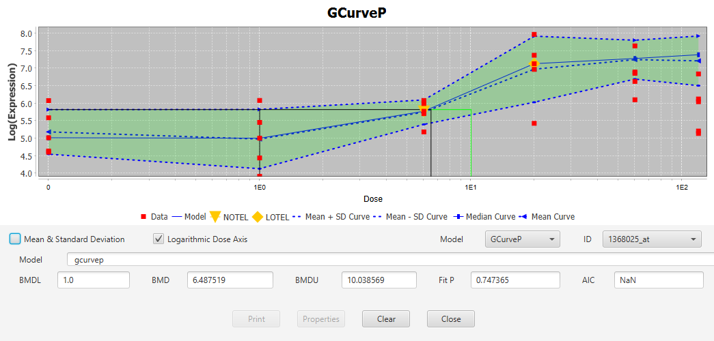

The interplay of biological effects, and/or artifacts in dose-response measurements can complicate the dose-response relationship, and result in an inappropriate curve fit. In order to simplify the signal pattern, GcurveP is applied to enforce monotonicity. The purpose of GcurveP is to capture and represent the direction of the signal change, with the assumption that certain response values are artifacts.

GcurveP is a non-parametric curve correction algorithm that operates on the assumption that the correct dose-response curve must exhibit monotonic behavior. The algorithm finds a minimal set of corrections needed to impose monotonic behavior to the dose-response curve. It takes the direction of monotonicity (increasing, flat, or decreasing) as the input parameter. It iteratively searches from each dose-group of the curve for monotonicity violations, and counts how many other curve points would need adjustments to restore monotonicity. It then shifts respective dose groups to achieve the goal. The resulting solution is the dataset with the minimal number of such points that require correction.

 Below is an example of one such correction, where red squares represent uncorrected data values, and blue represent GcurveP-adjusted values. The two treatement groups at highest dose are shifted to increased response, imposing monotonic behavior on the curve. For each dose group, estimated median response, and standard deviation are shown by dotted blue lines. 

### Algorithm

Monotonicity violations are detected based on the replicate measurements in each dose group. 
1) Each dose group weighted average response (wAR) and weighted standard deviation (wSD) is calculated using Tukey’s bi-weight function. Pooled variance across all dose groups is likewise used for weight-adjusted calculation of pooled standard deviation (PSD). PSD is used as the minimum allowed value of the standard deviation for any of the dose groups (sometimes, due to redundant replicates or artifacts some dose groups have nearly zero variance). If the PSD is lower than the dose group SD, SD is reset to PSD. 
2) The weighted average response (wAR) for the control dose group is then assumed to be the true baseline signal. All subsequent dose groups are checked, relative one other, for compliance with the assumed curve direction. At each step, the wAR of the given dose group D is checked if within one SD from the wAR of the currently trusted dose group C. If within, then D is accepted as monotonous, C is replaced with D and next dose group is checked. If wAR(D) is outside of one SD from wAR(C), but in the desired (pre-specified) direction, then D is treated the same as above, otherwise, it is marked as a violation, in which case C is not updated and the next dose group point is checked against C. 
3) Once all dose groups are thus evaluted, the number of violations represents the cost of restoring monotonicity for the initial choice of C (trusted pivot point). Iteratively trying different dose groups as C, GcurveP searches for a minimum set of dose groups that need to be adjusted. Once such set is found, each of its dose groups is then appropriately shifted with all its replicate points, to keep original variation of the response, but ensure that the average response is now monotonic.

Once monotonized, the resulting curve can undergo other stages of the analysis, including parametric fitting as well as calculation of various curve metrics (see below), which also receive confidence intervals from the bootstrapping procedure based on the supplied confidence level (e.g., alpha = 0.05, see below). 
This monotonicity correction process is repeated n times by bootstrap sampling (with a typical input parameter n = 1000) the responses from the original curve dose groups, to assess the stability of the monotonic corrections. A curve-correction quality metric (between 0 and 1) is then returned, which can be interpreted as the probability for the average response in the curve after monotonic treatment is the same as that in the original curve.

### GcurveP algorithm salient features
- signal scale independent (does not use signal values for quantitative fitting, only for relative comparisons). 
- can handle biphasic and partial curves, which are, otherwise, hard to fit by parametric models on only a few dose groups. 
- represents a dose-response curve by connected line segments and  uses this representation for point-of-departure dose imputation without curve fitting
- requires a curve signal direction to be pre-specified (by the user or by some other automatic means) in order to carry out the desired correction. In case of biphasic curves, both directions may be useful to represent corresponding effects
