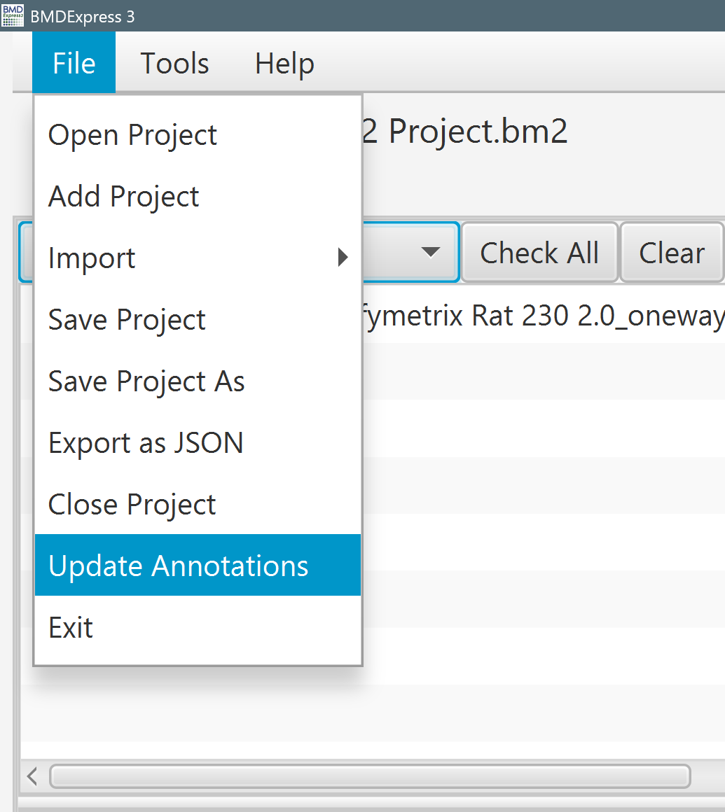
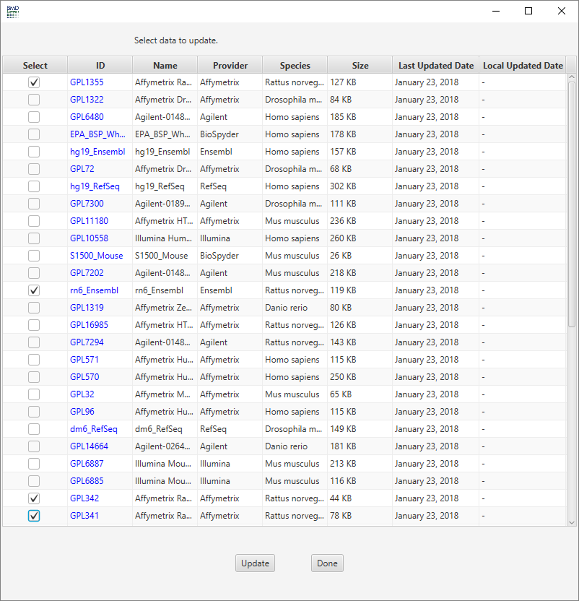
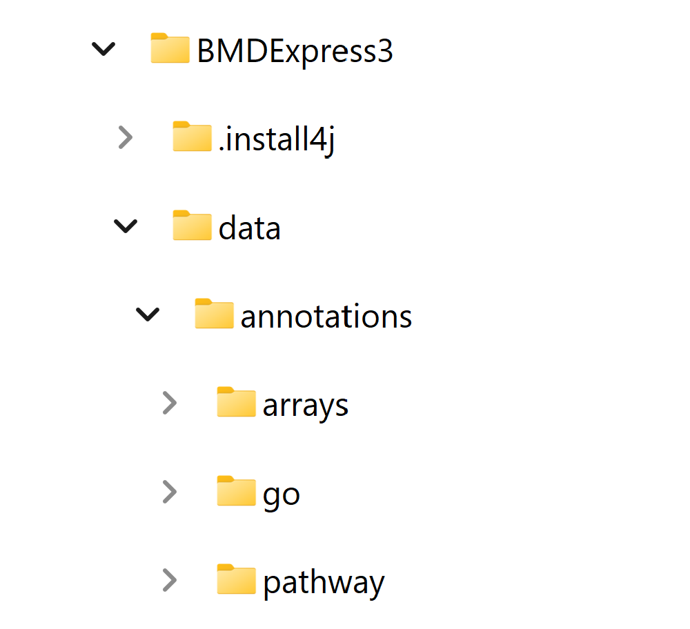
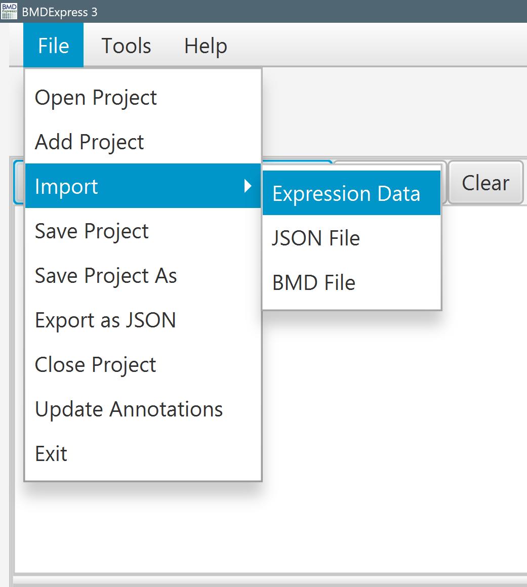
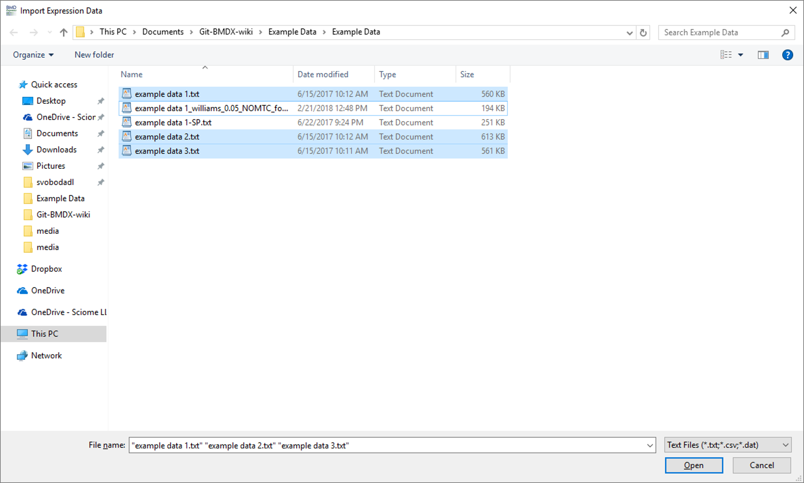
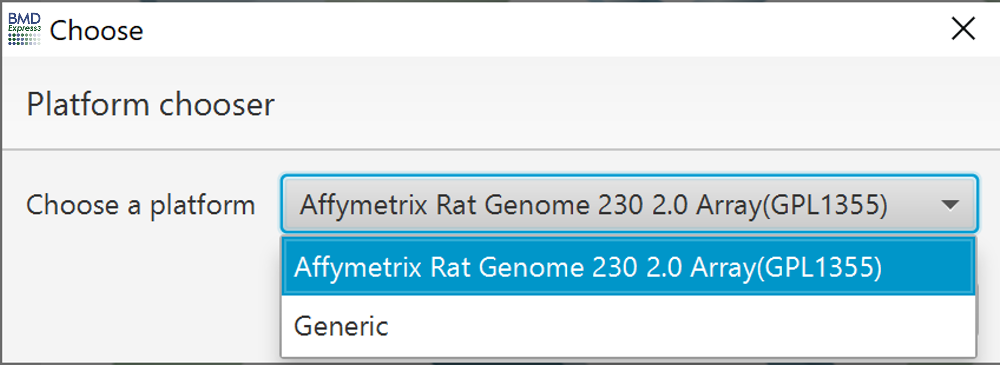
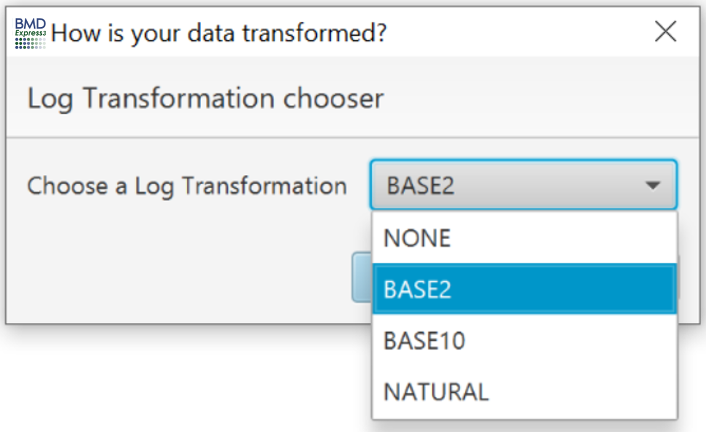
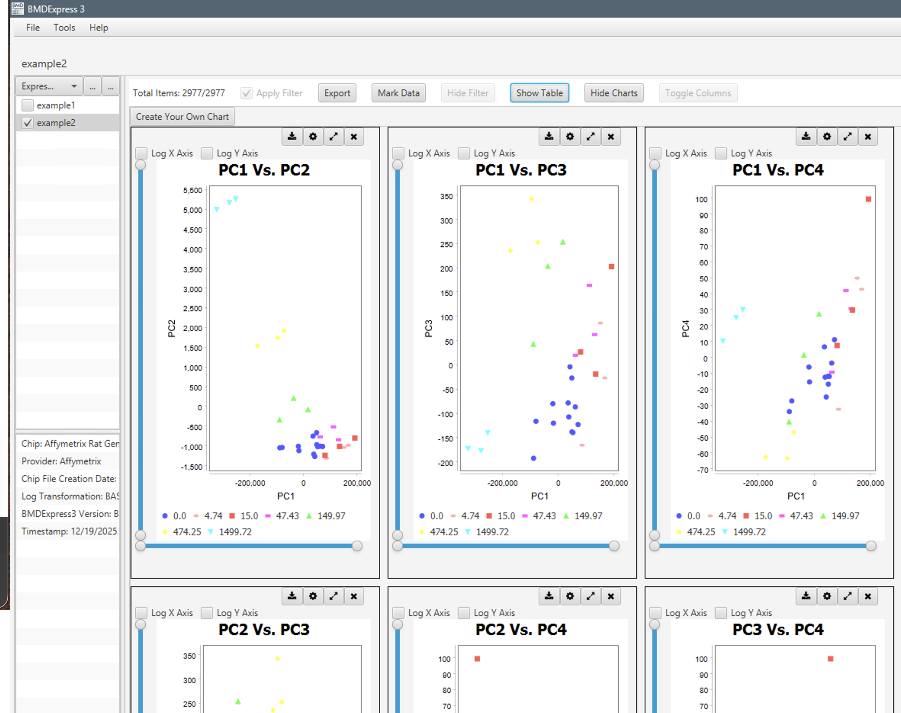
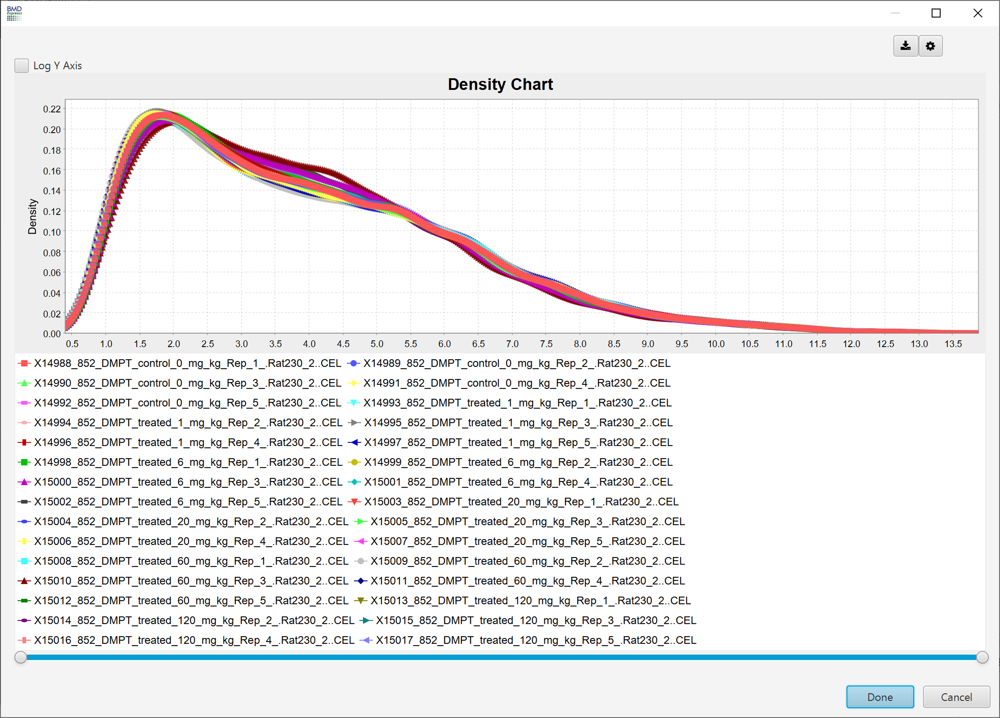
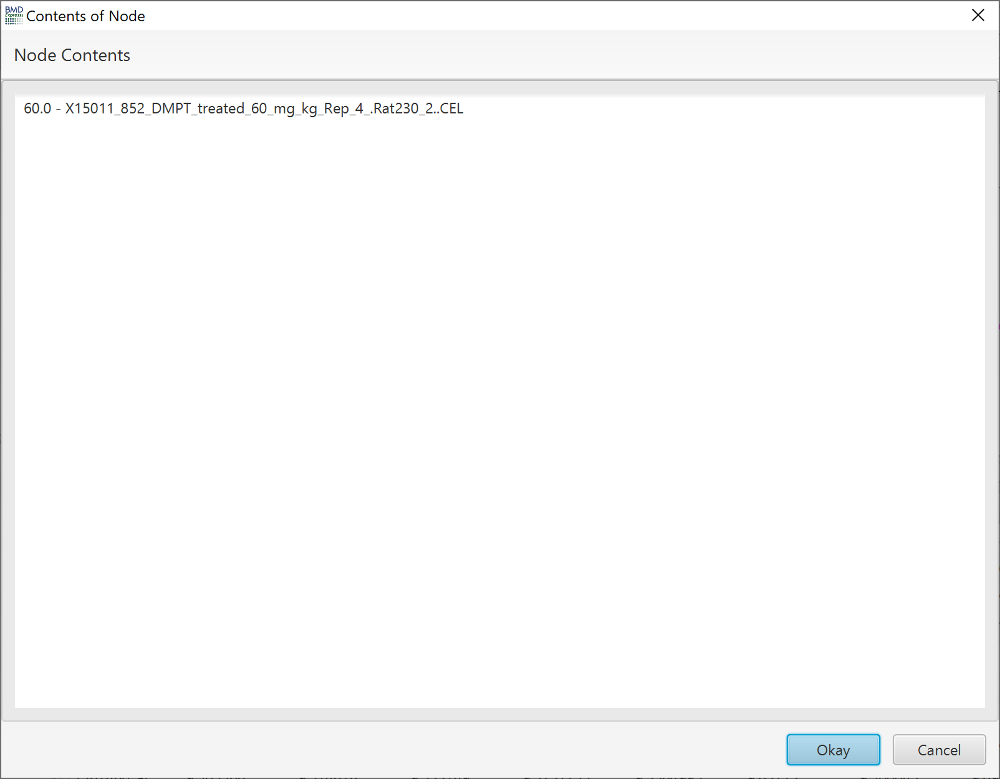

How To Use the Application
==========================

Update Annotations
------------------

[Video tutorial demonstrating how to update annotations](https://www.youtube.com/watch?v=z1nf2GX93uk&index=3&list=PLX2Rd5DjtiTeR84Z4wRSUmKYMoAbilZEc)

Before beginning an analysis, it is recommended to update any annotation files needed for the analysis. (Click `File > Update Annotations`)

 

Use the checkboxes on the left side of the popup to choose which annotation(s) to update. When finished, click `Update`.

 

If you are blocked from downloading the annotations due to IT security do the following:

Step 1.  Download the entire annotation dataset @ https://apps.sciome.com/bmdexpress3/annotations.zip

Step 2. Go to the directory C:\<User>\bmdexpress3

Step 3. If there is not a "data" directory in there, create it.

Step 4. Unzip the contents of annotations.zip into C:\<User>\bmdexpress3\data\

Step 5. Make sure that the directory structure looks correct.  There should be a directory C:\<User>\bmdexpress3\data\annotations\ with contents that look like the following.

 

Import Dose-Response Data
-------------------------

[Video tutorial demonstrating data import into BMDExpress 2](https://www.youtube.com/watch?v=TuF31IGblnQ&list=PLX2Rd5DjtiTeR84Z4wRSUmKYMoAbilZEc&index=4)

The first step in the workflow is to import gene expression data from a tab-delimited plain text file. We recommend using log-transformed data although this is not required. Each column in the data matrix must correspond to an individual expression experiment, and the first row must contain the doses at which the corresponding sample was treated. Subsequent rows contain the data for one probe/gene. An optional header row may also be included, in which case it must be the first row and the doses must be in the second row. You will be prompted when loading the data to indicate if the first row contains sample labels. Example data files are provided in the BMDExpress 2 installation folder.

**Note:** An "off label" use of BMDExpress is to perform dose response modeling on other continuous data types (e.g., clinical chemistry). The data simply needs to be formatted in the same manner as the genomic data and loaded into the software and identified as a "generic" platform. Since the dose response data has no gene labels, functional classification analysis cannot be performed.

 

Click `File > Import Expression Data`.

 

Navigate to, and select your data file(s). You may import multiple files at once on this screen. Then click `Open`.

 

After the file is read by the program, an array platform will be suggested. If the suggested platform is does not match your data set, select the correct platform from the dropdown list. If your platform is not contained in our [annotation set](how-to-use-the-application#update-annotations), select "generic". Then click `OK`. If "generic" is selected, probe annotations columns will be empty in the subsequent results tables. In order to perform [Functional Classifications](functional-classifications) a [Defined Category Analysis](functional-classifications#defined-category-analysis) will need to be carried out.e

 

Next, select the type of log transformation your data was prepared with.

 

Once the file(s) are loaded into the program, they will be displayed in the lower section of the main window. In the chart area, scatter plots of 6 pairs of principal components are shown. To identify data points in the PCA plot hold shift and click on the point of interest or mouse over the point and the sample name will pop-up.

 

Density plots of the expression data can be viewed by clicking the drop down in select chart view in the upper right and selecting "Density Chart". The chart shows a global distribution of intensities/counts for each sample in the selected expression data file.

 

Switch between expression data files using the data selection panel to the left. In this section only one data set at time can be loaded. In other sections of the application multiple data sets can selected and evaluated simultaneously.

 

Once you have loaded your data you should proceed sequentially through [Prefiltering](prefiltering), [Benchmark Dose Analysis](benchmark-dose-analysis), and [Functional Classification](functional-classifications).
