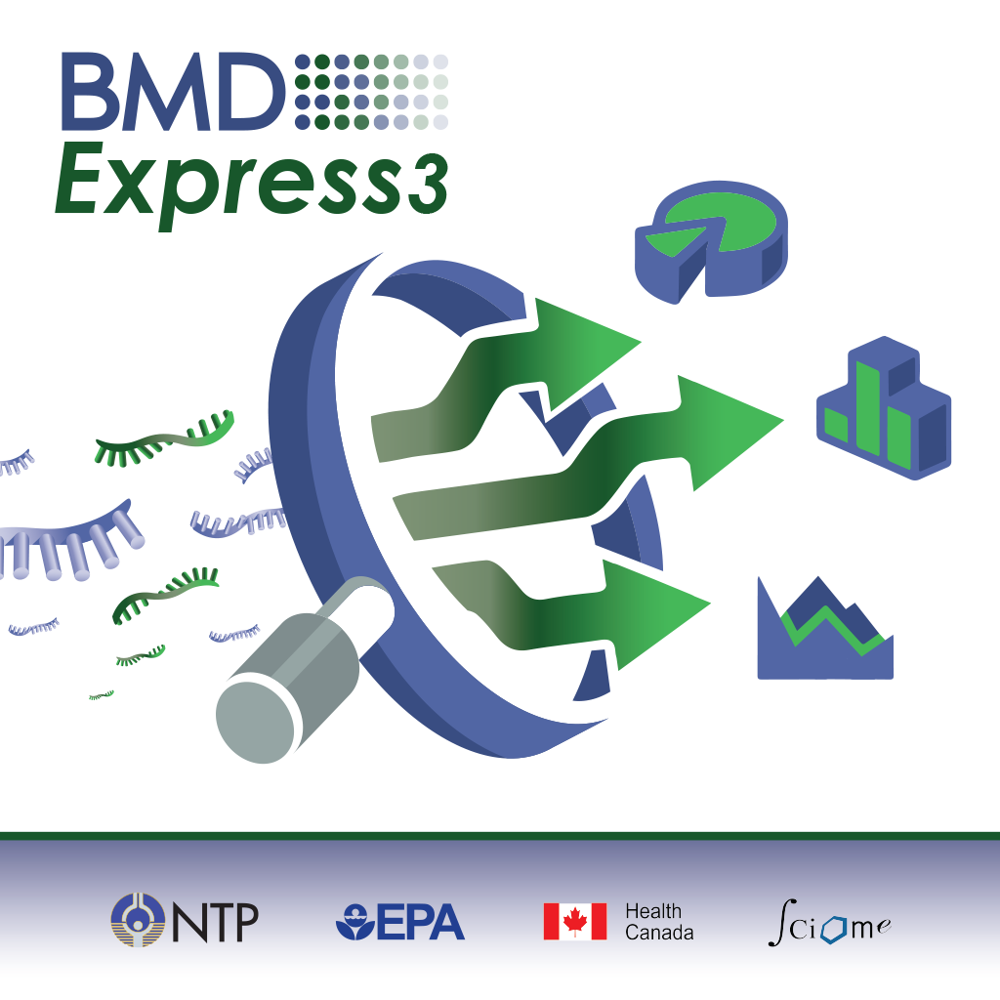
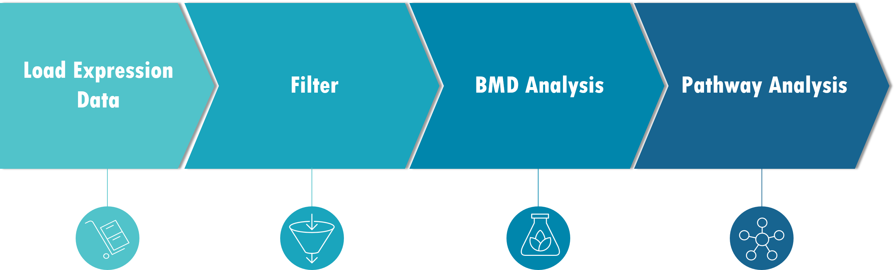

# Introduction

[Download BMDExpress 3 Software](https://github.com/auerbachs/BMDExpress-3/releases){: .btn .btn-primary .fs-5 .mb-4 .mb-md-0 .mr-2 }

[New Features in BMDExpress 3](https://youtu.be/0TrTMHz0OOY)

BMDExpress is a desktop application for Windows, Mac or Linux ([See IMPORTANT warning](benchmark-dose-analysis#important)) that enables analysis of dose-response data produced in differential gene expression experiments. It provides stepwise workflows that combine benchmark dose (BMD) calculations with functional classification analysis based on the combined probesets for individual genes, Gene Ontology ([GO](http://www.geneontology.org/)), Signaling Pathways ([Reactome](http://reactome.org/), [BioPlanet](https://tripod.nih.gov/bioplanet/)), or custom categories provided by the user. The end results are estimates of doses at which cellular processes are altered, based on an increase or decrease in response in expression levels compared to untreated controls. These estimates depend on fitting curves through the user's dose-response data. BMDExpress utilizes both parametric and non-parametric curve fitting methods. Model averaging is the new standard for analysis, and is introduced in version 3, but individual model curve fit "Best" BMD analysis is still available. EPA's parametric models are now implemented through native shared libraries, executed within the BMD Express application, rather than spawned individual processes. Finally, integrated IVIVE allows the user to convert benchmark concentration values from _in vitro_ studies into estimated external doses (i.e., oral equivalent doses).

**Parametric:** US EPA BMDS software

[BMDS website](https://www.epa.gov/bmds)

[BMDS User Manual](https://www.epa.gov/bmds/benchmark-dose-software-bmds-32-user-guide-readme)

**Non-parametric:** Sciome GCurveP

[GCurveP website](https://www.sciome.com/GCurveP/GCurvep.html)

**Examples:**

[Example BMDExpress expression data files](assets/images/files/example_data.zip)

**Note:** Compressed zip file that contains 3 expression data files. User will need to unzip before using.

[Example BMDExpress project file (.bm2)](assets/images/files/example_bm2.zip)

**Note:** Compressed zip file that contains the .bm2 file used in the [tutorial videos](https://www.youtube.com/playlist?list=PLX2Rd5DjtiTeR84Z4wRSUmKYMoAbilZEc). User will need to unzip the file before loading into BMDExpress.

## Basic Workflow

[Quickstart Video](https://www.youtube.com/watch?v=yWWG0bojLdc&index=1&list=PLX2Rd5DjtiTeR84Z4wRSUmKYMoAbilZEc)

[Before working with data, verify that necessary gene annotations are present, and up to date.](how-to-use-the-application#update-annotation-file) Annotations for the various genomic platforms are stored and maintained on the BMD Express 3 GitHub site. Before importing data, annotations must be present locally.

[Gene expression data is first imported into BMDExpress.](how-to-use-the-application#import-dose-response-data) The data must be correctly formatted as tab-delimited `.txt` files.

[Gene expression dose-response data is then (optionally) processed](prefiltering) using one of several choices of statistical model, together with a fold change filter to identify probes/probe sets that demonstrate dose-response behavior in accordance with user-specified thresholds. Filtering the probe sets for such a threshold in dose-response behavior is not required, but will reduce noise in the data and the computation time required in the subsequent steps in the analysis. Alternatively, data sets can be prefiltered outside of BMDExpress (i.e., genes removed according to user-defined critera), and a subset of the data loaded and modeled.

[Dose response data is then fit using one of three modeling methods](benchmark-dose-analysis):

- ToxicR Model Averaging (introduced in version 3)
- Sciome GCurveP (non-parametric)
- EPA BMDS Models (updated to use models from ToxicR in version 3)

ToxicR is an R package that utilizes the core functionality of the Benchmark Dose Software from US EPA (BMDS 3.2), together with BMDExpress 3, developed by the NIEHS (National Toxicology Program; NTP). It provides [model averaging through a Bayesean approach](assets/images/files/MA.pdf).

ToxicR, and GCurveP each produce a single output, [based on the choice of input parameters](benchmark-dose-analysis#benchmark-dose-data-options-non-parametric).

In the case of BMDS modeling, the model that best describes the data, while minimizing complexity is selected for subsequent procedures. [The user can apply two approaches for best model selection](benchmark-dose-analysis#benchmark-dose-data-options-parametric) including 1) a nested likelihood ratio test for the linear and polynomial models followed by an Akaike information criterion (AIC) that compares the best nested model to the exponential model, Hill model and the power model; or 2) a completely AIC-based selection process to compare all models.

After modeling is complete (best model in the case of BMDS), [probe/probeset identifiers are mapped onto unique genes](functional-classifications) based on [NCBI Entrez Gene identifiers](https://www.ncbi.nlm.nih.gov/gene). Entrez Gene IDs are subsequently matched to corresponding [Gene Ontology](http://www.geneontology.org/), Signaling Pathway (e.g., [Reactome](http://www.reactome.org/)), or user defined categories. Summary values representing the central tendencies and associated variability of the BMD, benchmark dose lower confidence limits (BMDL) and benchmark dose upper confidence limits (BMDU) for all the genes in each category are then computed.

Batchwise processing of multiple data sets is available at every step of the workflow. This is accomplished by standard multi-select keyboard/mouse click combinations specific to the host operating system.

[Results can then be exported](overview#exporting-analyses) as .csv files for additional analysis outside the scope of BMD Express.

Project files are saved in `.bm2` format or alternatively in `.json` format (much larger than `.bm2`). However, `.bmd` project files from the original BMDExpress can be imported, and transformed into the `.bm2` format. **Note:** `.bmd` files loaded into BMDExpress retain all annotations and results contained in the original file. Probe annotations may not match updated annotations that would be applied if the expression data was re-analyzed in the newer software, as annotations may have changed since the original analysis.

BMDExpress can analyze any continuous dose-response data. An example video on how to perform analysis on nongenomic data can be found [here](https://youtu.be/AhZHLbkLAuA).

Finally, [toxicokinetic(TK) modeling](functional-classifications#ivive), both IVIVE and forward TK is an adjunct functionality provided with BMDExpress as a convenience for additional post-processing of in vivo (in the case of forward TK) and *in vitro* transcriptomic data (in the case of IVIVE).

## Tutorial Videos

A [playlist of video tutorials](https://www.youtube.com/playlist?list=PLX2Rd5DjtiTeR84Z4wRSUmKYMoAbilZEc) created by Scott Auerbach is available. Videos will also be linked in each section for their relevant functions.
