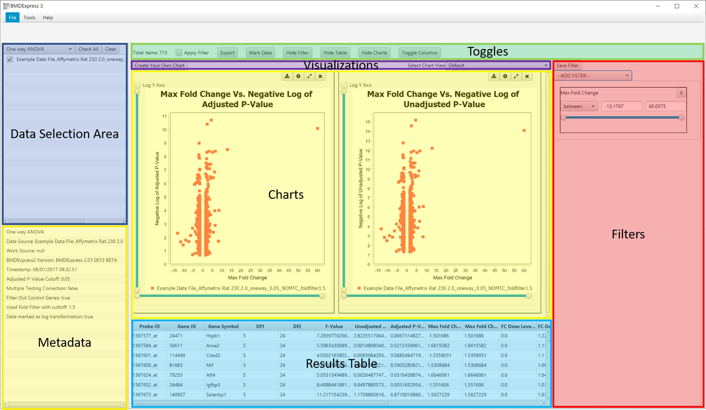
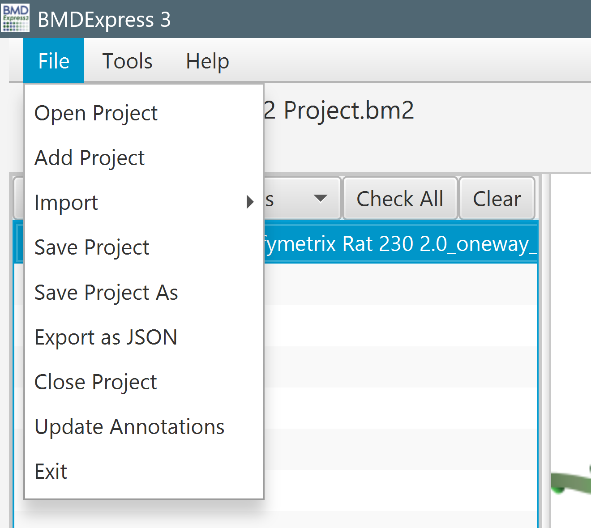
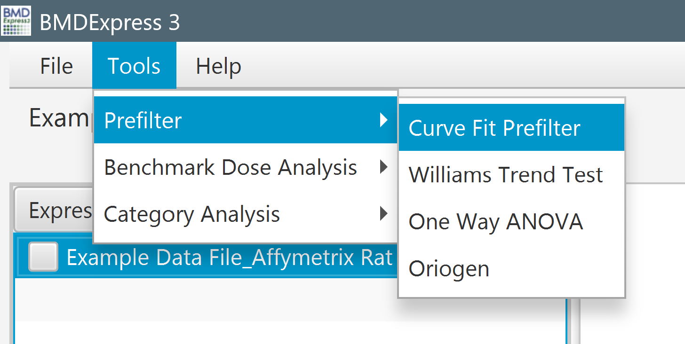
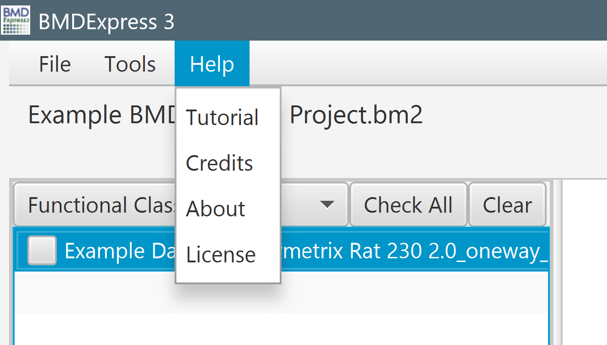
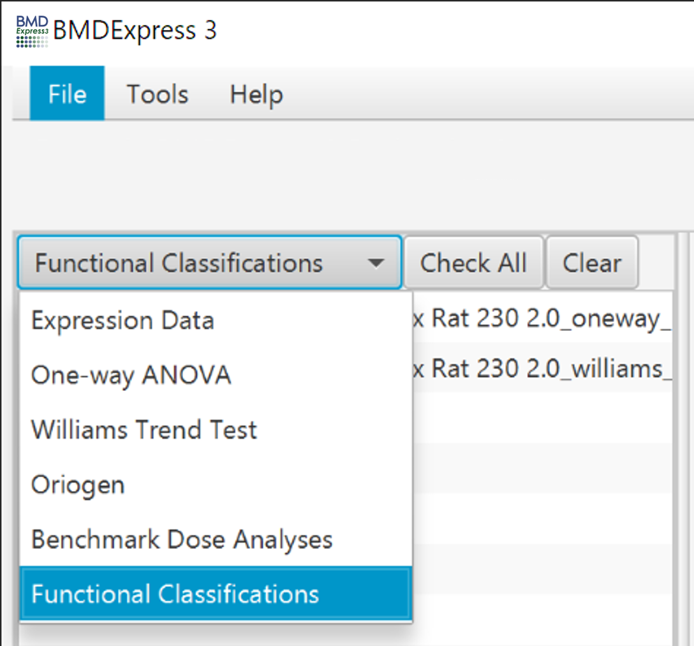
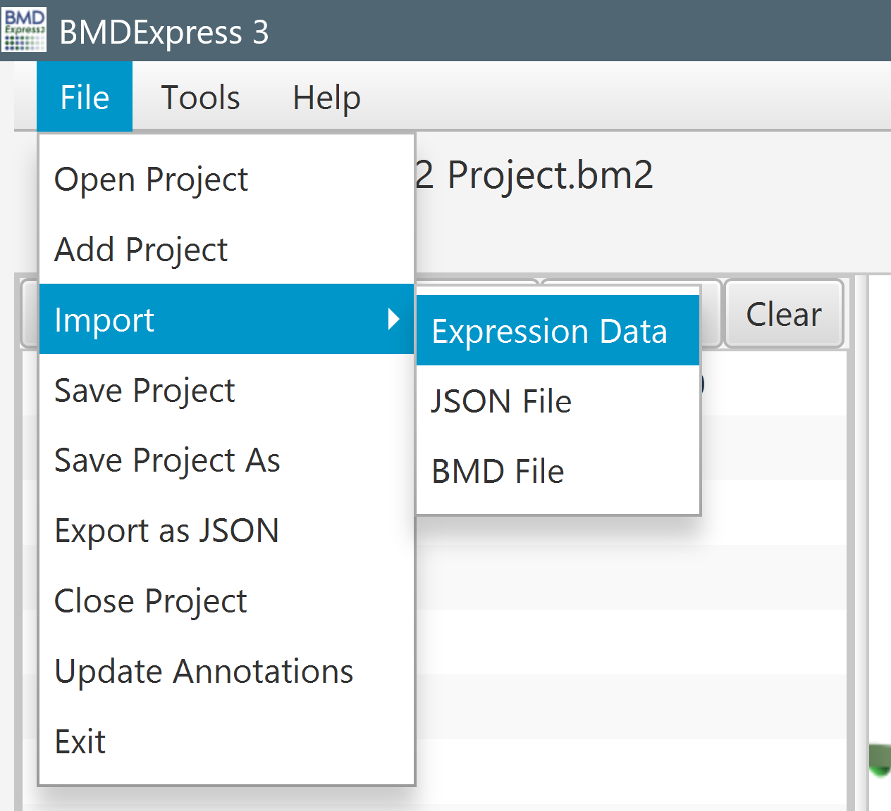
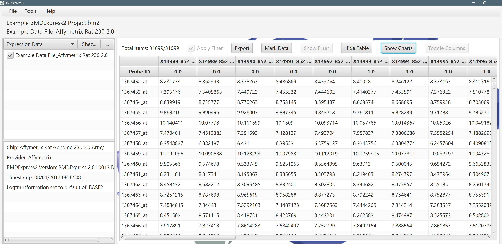
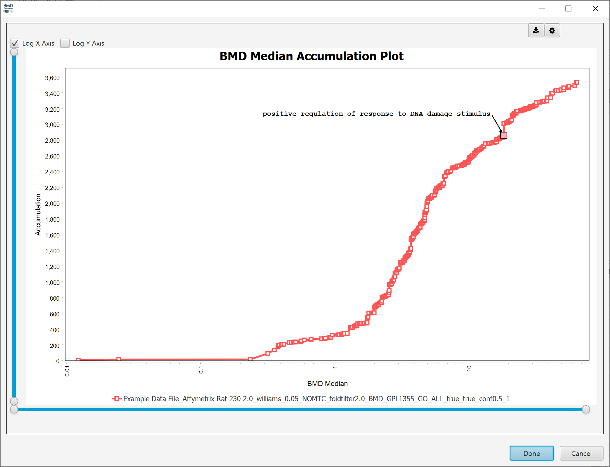

Overview of the Main View
=========================

Once data has been analyzed either via [Prefilter](prefiltering), [Benchmark Dose Analysis](benchmark-dose-analysis), or [Functional Classification](functional-classifications), the contents of the charts and results table areas will reflect the type of analysis selected in the *Data Selection Area*.

Main Toolbar
------------

### File

<strong>Open Project:</strong> Opens a dialog for selecting an existing <code>.bm2</code> file. The project file format for BMDExpress 2 is <code>.bm2</code> which is different than the original version of BMDExpress which used <code>.bmd</code> files. <code>.bmd</code> files can be loaded into BMDExpress 2 by using the "<em>Import &gt; BMD file function</em>" described below.

<strong>Add Project:</strong> Opens a dialog for selecting an existing <code>.bm2</code> file and adding it to the currently opened project. You can load multiple projects in the same space using this feature. This can be helpful if you have multiple <code>.bm2</code> files that contain comparable data analyses.

<strong>Import Expression Data:</strong> Opens a <a href="how-to-use-the-application.md#import-dose-response-data">dialog box</a> for choosing data to be imported into the current project.

<strong>Import &gt; JSON file:</strong> Imports a <code>.json</code> project file

<strong>Import &gt; Expression Data:</strong> Opens a dialog for choosing data to be imported into the current project.

<strong>Import &gt; BMD file:</strong> Imports a <code>.bmd</code> project file (project file format from the previous version of BMDExpress). <strong>Note:</strong> When importing the file, probe set-to-gene, GO and KEGG annotations from the original analysis are retained. If it is desired to update the genomic analysis, the Expression Data should re-imported, associated with the updated annotations, and re-analysis from start to finish performed.

<strong>Save Project:</strong> Saves the current project in <code>.bm2</code> format. If you wish to export data to be viewed in other software, <a href="overview-of-the-main-view.md#exporting-analyses">please see the section on exporting data.</a>

<strong>Save Project As:</strong> Saves the current project under a different name.

<strong>Export as JSON:</strong> Saves the current project in <code>.json</code> format.

<strong>Close Project:</strong> Closes the current project without exiting the program.

<strong>Update Annotations:</strong> Opens a dialog for <a href="how-to-use-the-application.md#update-annotations">updating the annotation files</a> used to parse imported data into Entrez Gene IDs.
 

### Tools

<strong>Prefilter:</strong> <a href="Statistical-and-Fold-Change-Prior-to-BMD-modeling">Reduce the number of data items for BMD computation based on statistical significance of a response to increasing dose.</a>

<strong>Benchmark Dose Analysis:</strong> <a href="Benchmark-Dose-Analysis">Configure and execute benchmark dose computation.</a>

<strong>Category Analysis:</strong> Configure and execute functional classification based on <a href="Functional-Classifications">GO terms</a>, <a href="Functional-Classifications">Reactome categories</a>, or <a href="Functional-Classifications#defined-category-analysis">user-defined gene categories</a>.

 

### Help

<strong>Tutorial:</strong> A link to this documentation.

<strong>Credits:</strong> A popup containing all contributors to the software.

<strong>About:</strong> A popup containing general information about the software.

<strong>License:</strong> A popup containing all license information regarding this software.

 

Data Selection Area
---------

The *Data Selection Area* is used to navigate among the various analyses that have been performed in the current project. The dropdown is for choosing a data view; imported data, filtered data, benchmark analyses, and categorical analyses. Metadata for the highlighted row in the experiment list is displayed in the metadata panel at the bottom left.

 

### Data Selection Area Additional Functions

By right-clicking on an individual analysis, the user can choose to `Rename`, `Remove` or `Export` the analysis, or open the `Spreadsheet View`. When the data view is `Benchmark Dose Analysis`, `Export Best Models` and `Re-select Best models` are additional options.

Within a data view, ticking boxes next to the experiment name causes the charts and results table to update, displaying the selected data set(s).

  

### Exporting Analyses

Right-click on an individual data set, then click `Export` to export the analysis to a tab-separated text file. Batch-export multiple analyses by multi-selecting analyses, then `Right-click` and choose `Export`. `Export Best Models` limits the data exported to that of the best model from BMDS analysis.

### Spreadsheet View

Right-click on an individual data set in either [One-way ANOVA](Statistical-and-Fold-Change-Prefiltering#one-way-anova-options), [Williams Trend](Statistical-and-Fold-Change-Prefiltering#williams-trend-test-options), [Oriogen](Statistical-and-Fold-Change-Prefiltering#oriogen-options), [Benchmark Dose Analysis](benchmark-dose-analysis), or [Functional Classification](functional-classifications) sections, and select `Spreadsheet View`.

<h4 style="margin-top: 0;">Spreadsheet Panel</h4>

The spreadsheet panel, together with the Toggle, Visualization, Filter, Chart and Table panels are useful for digging down into a subset of data and/or compare different datasets. Any filters, selected rows, and charts viewed will not be affected by any other actions in the main window.

<h4 style="margin-top: 0;">Metadata Panel</h4>

This panel contains information about the currently selected analysis.

 

Toggles Panel
-------------

- **Total Items:** The total number of rows in the currently selected analysis. When filters are applied, this will update to show *visible rows*/*total rows*.
- **Apply Filter:** Turns filters on or off that are controlled with the [filter panel to the right](#filters-panel). If the panel is not visible, then click the `Show Filter` button.
- **Mark Data:** When clicked, a search window appears, enabling text searching of GO terms, or Reactome categories. Data visible in the charts and table views is filtered according the search results.
- **Hide/Show Filter:** Hides and shows the [filter panel](#filters-panel) on the right side of the window.
- **Hide/Show Table:** Hides and shows the [results table](#results-table) at the bottom of the window.
- **Hide/Show Charts:** Hides and shows the [charts](#charts) in the center of the window.
- **Toggle Columns:** Opens a window for choosing which columns to display/hide in the table.

Visualizations Panel
--------------------

- **Create Your Own Chart:** Brings up a workflow that enables creation of a user-defined chart. 5 chart types are available, with the user choosing axes from available columns in the table view, as appropriate. After completion of the workflow, the user-defined chart appears in the [charts panel](#charts). A tutorial on how to create your own chart can be found [here](https://youtu.be/qUb_GDpZl6g)

- **Select Chart View:** Shows [additional visualizations](#charts) based on analysis type.

Filters Panel
-------------

Allows the user to select and apply specific data filters. The options available in the filters panel differ based on the selected analysis type/result (i.e. One-way ANOVA, Williams, Oriogen, Benchmark Dose Analysis, and Functional Classification).

Filters update the data viewed in the charts and results table section as soon as they are entered. There is no need to click an *apply* button to render any changes to the filters. You do need to make sure that the `Apply Filter` checkbox is ticked in the [toggles](#toggles-panel) section though.

It is possible to save the filter settings by first selecting and parameterizing the preferred settings and then clicking `Save Settings` button at the top of the filter section. **Note:** Due to differences in the size of the results from each data set the "between" function for the settings will be reset with each data set therefore it is recommended that save setting only use functions such as ">" or "<" to save filter settings.

Results Table
-------------

The columns of the results table differ based on the current analysis.

- [Pre-filter Results](Statistical-and-fold-change-prefiltering#Prefilter-results)
- [Benchmark Dose Results](benchmark-dose-analysis#benchmark-dose-results)
- [Functional Classification Results](functional-classifications#functional-classification-results)

Columns can be sorted by left-clicking on headers. Column widths may be resized, and column order, left to right, may be rearranged.

Charts
------

The central panel containing all visualizations for selected analyses.

The available visualizations differ for each analysis type:

- [Pre-filter Visualizations](Statistical-and-fold-change-prefiltering#Prefilter-visualizations)
- [Benchmark Dose Visualizations](benchmark-dose-analysis#benchmark-dose-visualizations)
- [Functional Classification Visualizations](functional-classifications#functional-classification-visualizations)

Depending on screen size, you may need to adjust some of the panels and/or use the vertical and horizontal scrollbars in the charts panel in order to see all of the available charts.

Charts may be enlarged by clicking on the arrow icon in the upper right of the chart.

Some charts have adjustable features (e.g., axis adjustment) that are found under the sprocket icon in the upper right of the chart.

Data used to generate the chart can be downloaded by clicking on the download icon in the upper right of the chart.

Charts characteristics (e.g., font type and size, colors) are adjustable by by right clicking on the plot and selecting "Properties".

Charts can be exported in PNG or JPG format by right clicking on the chart and selecting "Export As" and then selecting the format of the image file.

When evaluating a Defined Category Analysis (i.e., you have provided your own gene set annotations) results in the Functional Classifications section it is possible to label plots by entering the gene set names contained in "GO/Pathway/Gene Set Name" column in the results table directly into the "Select Gene Sets To Highlight" lower box and then clicking `Okay`.

It is possible to label the features in select plots where the plotted data points represent probes, genes or pathways (e.g., Accumulation, Bubble and Scatter Plots). To do this select `Mark Data` and the "Select Gene Sets to Highlight" box will open. Then select whether your want to use GO terms or Reactome from the drop down, select how you would like to search your term and beginning typing in the search box. Gene set names will begin to populate the list, at which point you can select the one you want and the genes annotate to the selected set  (Prefilter or Benchmark Dose Analysis Section) or the selected gene set name (Functional Classification) will populate the lower box. Finally, click `Okay` and your plots will be labeled. Labels can be moved by clicking and dragging them in the visualization. A tutorial on how to mark your data can be found [here](https://youtu.be/dU3TjSbAZ6A).

Labeling features in a plot is also possible by holding the shift key and selecting the data point in the visualization. Only one data point at a time can be labeled using this approach.

 
