Prefiltering
========================================

Introduction
------------

[Video tutorial demonstrating how to setup statistical filtering](https://www.youtube.com/watch?v=YmzF4rXagzo&list=PLX2Rd5DjtiTeR84Z4wRSUmKYMoAbilZEc&index=6)

The number of probes contained within a given genomics platform is typically on the order of tens of thousands. By selecting only probes with a statistically significant dose response, the computation required to complete the subsequent analysis steps is minimized. Curve Fit, ANOVA, Williams trend [4], ORIOGEN (Order Restricted Inference for Ordered Gene Expression) [5], and fold change filters can be used to remove probes with small or statistically insignificant dose dependent expression changes. **Note:** The user can model all probes that are loaded in the expression data file (i.e., skip prefiltering and go directly to BMD modeling), however we recommend prefiltering to reduce noise and modeling run time.

**Curve Fit** prefiltering works by running the ToxicR (EPA BMDS v3) curve fitting process in combination with the Wald method for confidence interval estimation to accelerate the modeling process. The models that are run are selected by the user along with a BMR threshold (recommended threshold of 2 or higher), and a max fold change cutoff. For each probe a best model is select by first identifying and the models with convergent BMD, BMDL, and BMDU values and then selecting amongst those based on the lowest AIC. If the best model yields a BMD below the highest dose used in the study then a probe is considered dose-responsive, and is reported in the results. Note that BMD/BMDL ratios and global goodness of fit p-value are not included as criteria for reporting probe as dose responsive.

The **ANOVA** test is a test of the null hypothesis that the responses at the different doses are all the same. The alternative hypothesis for ANOVA is that the responses are not all the same, with no restriction on the direction of change of the responses.

The two-sided **William’s** trend test compares a null hypothesis of no dose response with an alternative hypothesis of monotonically increasing or monotonically decreasing response (i.e., a response that either never decreases with increasing dose, or never decreases with increasing dose, with at least one change in response with increasing dose). An isotonic regression (nonparametric regression that fits a monotonic response to the data) is used to obtain estimates of dose specific response and resulting test statistics.

**ORIOGEN** is a non-parametric procedure that simultaneously identifies significant genes, and groups them according to patterns of inequalities. The implementation of ORIOGEN implemented in BMDExpress 2 computes the overall significance p-value for a gene by testing a null hypothesis of no dose response, against the union of alternate dose response profiles (such as monotone, umbrella shaped etc.).  Adaptive bootstrap techniques are employed during significance p-value computation, and multiple correction stages thereby minimizing compute time.

After choosing a data set(s) from the Data Tree, select 'Curve Fit Prefilter', 'One-way ANOVA', 'Williams Trend', or 'ORIOGEN' from the 'Tools' menu. Fill in the parameters, and click, 'Start'.

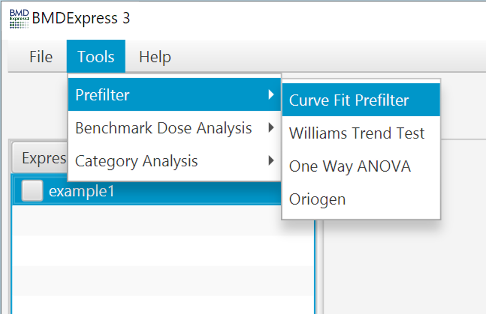

[Video tutorial describing data filtering setup in detail](https://www.youtube.com/watch?v=YmzF4rXagzo&index=6&list=PLX2Rd5DjtiTeR84Z4wRSUmKYMoAbilZEc)

### Curve Fit Prefilter Options
- **Expression Data:** Choose data to be filtered.
- **Hill, Power, Exp 3, Exp 5, Power:** Tick boxes of desired models to fit.
- **BMR Factor, Variance:** Choose modeling parameters. For BMR, we recommend 2 or higher. The higher the BMR, the lower the false discovery.
- **Fold Change :** Optionally choose a fold change cutoff to remove probes prior to curve fitting.
#### NOTEL/LOTEL Determination
- **P-Value:** Statistical threshold applied to the NOTEL/LOTEL test
- **Fold Change Value:** Threshold for NOTEL/LOTEL determination that is applied in combination with the p-value. Note: If data are loaded in linear form (i.e., "NONE" designation for transformation) the arithmetic mean of the dose groups is used to calculate the fold change values. If data are log transformed when loaded the geometric mean of the dose groups is used to determine fold change values.
- **Dunnett's or T-Test:** Both test are pairwise tests. The t-test option is a [students t-test](https://en.wikipedia.org/wiki/Student%27s_t-test) and the [Dunnett's test](https://en.wikipedia.org/wiki/Dunnett%27s_test) is statistical test that takes into account multiple comparisons that are common in gene expression data.
#### Execution Parameters
- **Number of Threads:** Number of concurrent processes to assign.
- **Progress Bar:** Approximation of percent completion.

- **Note:** The curve fit prefilter is the only prefilter that will work with expression data where there is only one replicate per dose level, however the paired NOTEL/LOTEL calculations will fail as expected due to lack of biological replicates

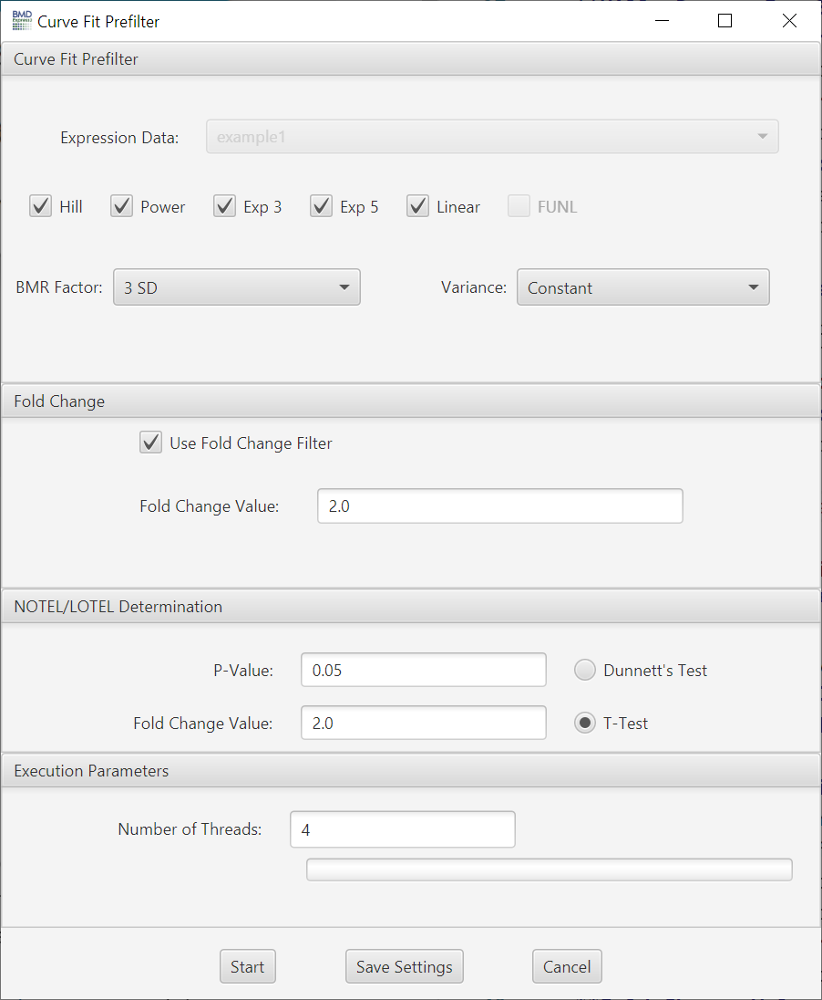

### One-Way ANOVA Options
- **Expression Data:** Choose data to be filtered.
- **P-value Cutoff:** A filter based on the *p*-value. Set to 0.05 by default; also includes 0.1 and 0.01 as default options, but you can enter any value.
- **Multiple Testing Correction:** False discovery rate correction applied to the selected *p*-value.[2]
- **Filter Out Control Genes:** Remove platform specific internal control genes (e.g. AFFX\_xxxxx) from the analysis.
- **Use Fold Change Filter:** If this option is unchecked, all other options in this section will be disabled.
- **Fold Change**: A minimum fold change for inclusion in the BMD computation may be selected. Note: If data are loaded in linear form (i.e., "NONE" designation for transformation) the arithmetic mean of the dose groups is used to calculate the fold change values. If data are log transformed when loaded the geometric mean of the dose groups is used to determine fold change values.
#### NOTEL/LOTEL Determination
- **P-Value:** Statistical threshold applied to the NOTEL/LOTEL test
- **Fold Change Value:** Threshold for NOTEL/LOTEL determination that is applied in combination with the p-value. Note: If data are loaded in linear form (i.e., "NONE" designation for transformation) the arithmetic mean of the dose groups is used to calculate the fold change values. If data are log transformed when loaded the geometric mean of the dose groups is used to determine fold change values.
- **Dunnett's or T-Test:** Both test are pairwise tests. The t-test option is a [students t-test](https://en.wikipedia.org/wiki/Student%27s_t-test) and the [Dunnett's test](https://en.wikipedia.org/wiki/Dunnett%27s_test) is statistical test that takes into account multiple comparisons that are common in gene expression data.
#### Execution Parameters
- **Number of Threads:** Number of concurrent processes to assign.
- **Progress Bar:** Approximation of percent completion.

- **Note:** The one-way ANOVA along with the NOTEL/LOTEL calculation will fail with expression data where there is only one replicate per dose level.

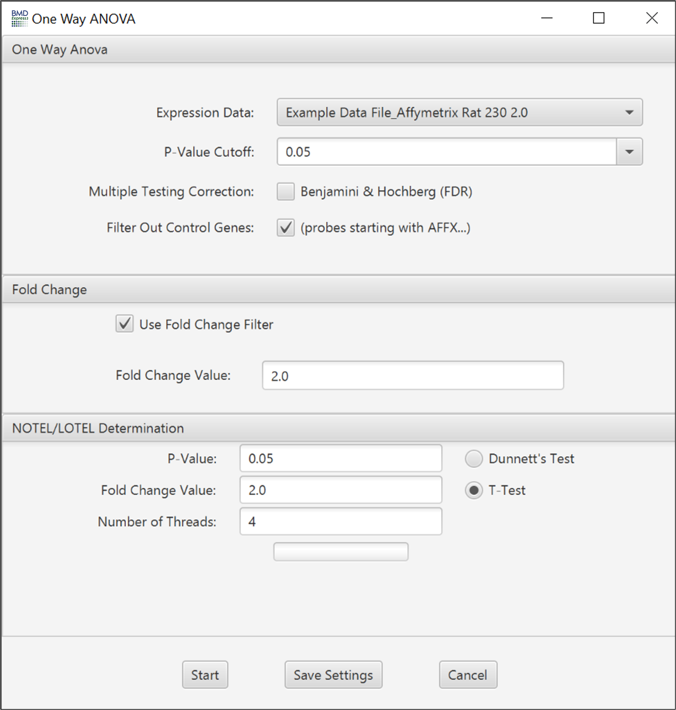

### Williams Trend Test Options
- Note: you may need to enlarge the set box to see all setting options
- **Expression Data:** Choose transcriptomic data set to be filtered.
- **P-value Cutoff:** A filter based on the *p*-value. Set to 0.05 by default; also includes 0.1 and 0.01 as default options, but you can enter any value.
- **Number of Permutations:** This is the number of randomized dose-response sets used in computation of the trend, and associated statistics.
- **Multiple Testing Correction:** False discovery rate correction applied to the selected *p*-value.[2]
- **Filter Out Control Genes:** Remove platform specific internal control genes (e.g. AFFX\_xxxxx) from the analysis.
#### Fold Change
- **Use Fold Change Filter:** If this option is unchecked, all other options in this section will be disabled.
- **Fold Change**: A minimum fold change for inclusion in the BMD computation may be selected.
#### NOTEL/LOTEL Determination
- **P-Value:** Statistical threshold applied to the NOTEL/LOTEL test
- **Fold Change Value:** Threshold for NOTEL/LOTEL determination that is applied in combination with the p-value
- **Dunnett's or T-Test:** Both test are pairwise tests. The t-test option is a [students t-test](https://en.wikipedia.org/wiki/Student%27s_t-test) and the [Dunnett's test](https://en.wikipedia.org/wiki/Dunnett%27s_test) is statistical test that takes into account multiple comparisons that are common in gene expression data.
#### Execution Parameters
- **Number of Threads:** Number of concurrent processes to assign.
- **Progress Bar:** Approximation of percent completion.

- **Note:** The Williams trend test along with the NOTEL/LOTEL calculation will fail with expression data where there is only one replicate per dose level.

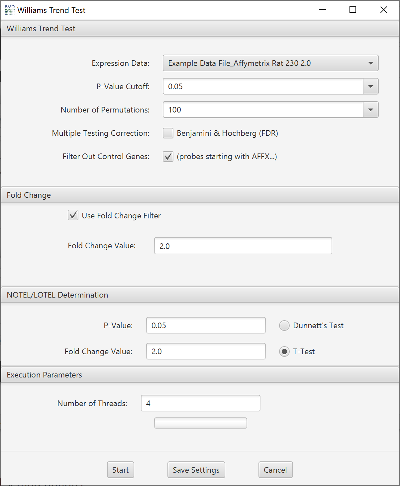

### ORIOGEN Options
- Note: you may need to enlarge the set box to see all setting options
- **Expression Data:** Choose transcriptomic data set to be filtered.
- **P-Value Cutoff:** A filter based on the *p*-value. Set to 0.05 by default; also includes 0.1 and 0.01 as default options, but you can enter any value.
- **Number of Permutations:** This is the number of randomized dose-response sets used in computation of the trend, and associated statistics.
- **Number of Initial Bootstrap Samples:** ORIOGEN uses an adaptive bootstrap p-value computation to maximize computational efficiency. This option sets the starting number of bootstrap samples used to compute the p-value for all the probes. ORIOGEN will start with this number of bootstrap samples and then gradually increase it, if necessary, until the number of samples reaches the maximum (set in the next option).
- **Number of Maximum Bootstrap Samples:** Maximum number of bootstrap samples used to compute the p-values for all the probes
- **Shrinkage Adjustment Percentile:** Used to control for false positives that can be identified when probes exhibit minimal variability. Default is set to 5.0, which reflects 5th percentile standard deviation of all probes in the data set. As the parameter decreases fewer probes are likely to pass the filter.
- **Multiple Testing Correction:** False discovery rate correction.[2]
- **Filter Out Control Genes:** Remove platform specific internal control genes (e.g. AFFX\_xxxxx) from the analysis.
#### NOTEL/LOTEL Determination
- **P-Value:** Statistical threshold applied to the NOTEL/LOTEL test
- **Fold Change Value:** Threshold for NOTEL/LOTEL determination that is applied in combination with the p-value
- **Dunnett's or T-Test:** Both test are pairwise tests. The t-test option is a [students t-test](https://en.wikipedia.org/wiki/Student%27s_t-test) and the [Dunnett's test](https://en.wikipedia.org/wiki/Dunnett%27s_test) is statistical test that takes into account multiple comparisons that are common in gene expression data.
Configure ORIOGEN and Fold Change options. Click 'Start'.
#### Execution Parameters
- **Number of Threads:** Number of concurrent processes to assign.
- **Progress Bar:** Approximation of percent completion.

- **Note:** The Oriogen trend test along with the NOTEL/LOTEL calculation will fail with expression data where there is only one replicate per dose level

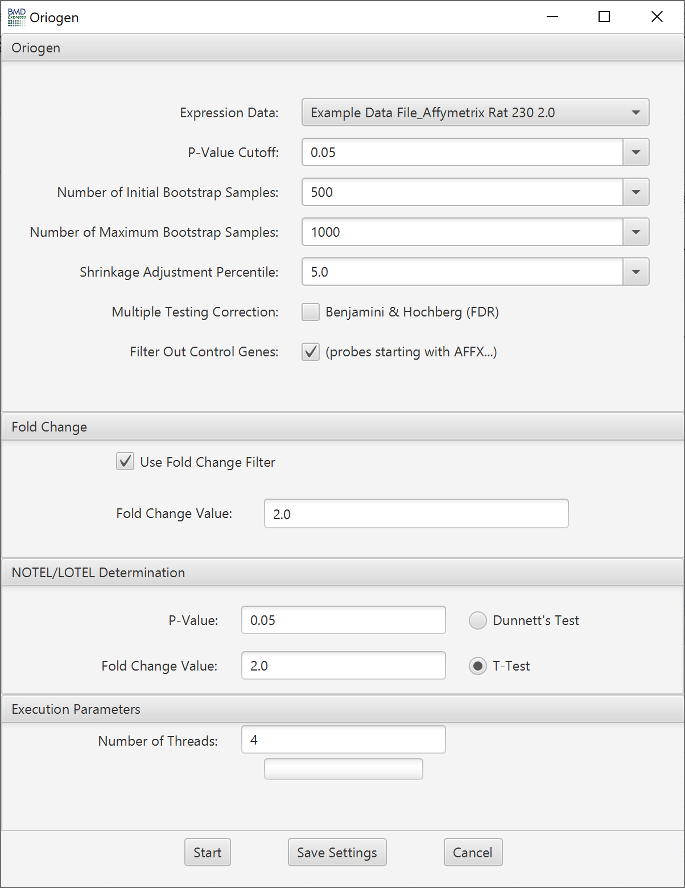

### Prefilter Results

[Video tutorial describing data filtering results](https://www.youtube.com/watch?v=YDOwjQtfLLc&index=7&list=PLX2Rd5DjtiTeR84Z4wRSUmKYMoAbilZEc)

Results are tabulated in the results table. Output consists of:

The **prefilter step** in BMD Express is the first stage of the analysis workflow, designed to quickly identify which gene expression datasets show a statistically significant response to dose. This initial screening process allows you to filter out thousands of genes that show no effect, making the subsequent, more computationally intensive BMD modeling much faster. There are four different prefilter tests available, each with its own statistical approach.

***

### 1. One-Way ANOVA

The **One-Way ANOVA (Analysis of Variance)** prefilter is a classic statistical test that compares the means of three or more groups to determine if there are significant differences between them. In the context of a dose-response study, it tests whether there are statistically significant differences in gene expression between the control group and any of the treated dose groups. A significant p-value from an ANOVA test suggests that a dose-dependent change is occurring, though it doesn't specify the dose where the effect starts or if the effect is monotonic.

- **Df1, Df2**: The degrees of freedom for the F-test. **Df1** is the number of treatment groups minus one, and **Df2** is the total number of samples minus the number of treatment groups. These values are used to determine the statistical significance of the F-value.
- **F-Value**: The F-statistic from the ANOVA test. A higher F-value indicates a greater difference between the group means relative to the variability within the groups.
- **Unadjusted P-Value**: The raw p-value from the ANOVA test. A low p-value (e.g., < 0.05) suggests a significant difference between at least one of the dose groups and the control.
- **Adjusted P-Value**: The p-value after applying a multiple testing correction (e.g., Benjamini-Hochberg). This is the more reliable value for determining significance when analyzing thousands of genes simultaneously.
- **Max Fold Change**: The maximum observed fold change across all dose levels. It provides a quick look at the largest biological effect.
- **Max Fold Change Unsigned**: The absolute value of the maximum fold change, useful for ranking genes by magnitude of response regardless of direction.
- **FC Dose Level 1-8**: The fold change values at each specific dose level. These are the raw, observed data points that show the expression change at each dose.
- **NOTEL/LOTEL T-Test p-Value Level 1-8**: These are the p-values from a two-sample t-test comparing each individual dose group to the control group. A p-value below the significance threshold at a specific level helps determine the **Lowest Observed Effect Level (LOTEL)**, and the highest dose with an insignificant p-value determines the **No Observed Effect Level (NOTEL)**.
- **NOTEL**: The highest dose at which no statistically significant effect was observed.
- **LOTEL**: The lowest dose at which a statistically significant effect was observed.

***

### 2. Williams Trend Test

The **Williams Trend Test** is a specific type of statistical test used for dose-response data. It's designed to detect a **monotonic (unidirectional)** dose-response relationship. It tests whether the mean response increases or decreases with increasing dose. This is a more powerful and appropriate test than a general ANOVA if you expect the response to consistently change with dose. 

- **Unadjusted P-Value, Adjusted P-Value**: These are the raw and multiple-testing-corrected p-values from the Williams trend test. A significant p-value indicates a statistically significant monotonic trend. This is the primary output for filtering.
- **Max Fold Change, Max Fold Change Unsigned**: Same as the ANOVA prefilter, these provide the maximum observed biological effect.
- **FC Dose Level 1-8**: The raw fold change values at each dose level.
- **NOTEL/LOTEL T-Test p-Value Level 1-8**: These t-test p-values are used to identify the NOTEL and LOTEL, similar to the ANOVA prefilter.
- **NOTEL, LOTEL**: The No-Observed-Effect Level and Lowest-Observed-Effect Level determined by the t-tests.

***

### 3. Curve-Fit Prefilter

The **Curve-Fit Prefilter** is a more sophisticated approach that actually fits a dose-response model to each gene's data, but with simplified statistical criteria. It's essentially a fast, preliminary BMD analysis. It checks if a good-fitting BMD model can be found and if the resulting BMDL is below a certain threshold. It's useful for finding genes that not only show a response but also fit a predictable dose-response curve.

- **Best Model**: The name of the dose-response model (e.g., Hill, Power, Exponential) that provided the best fit to the data for this gene.
- **Best BMD, Best BMDL**: The Benchmark Dose and its lower confidence limit from the best-fitting model. These are preliminary estimates and are not as rigorously vetted as the final BMD analysis results.
- **Goodness of Fit**: This is a statistical metric (a p-value in this case) that indicates how well the best-fitting model describes the data. A more detailed description of the global goodness of fit p-value can be found in the BMD modeling section of the wiki. The higher the p-value the better the model fits to the data, hence a low p-value (e.g. <.1) generally indicates a poor fit. Note: the goodness of fit p-value is not a criteria for passing the curve fit prefilter. It can be used later in the analysis to filter probes being passed into the functional classification. 
- **Max Fold Change, Max Fold Change Unsigned**: Same as the other prefilters.
- **FC Dose Level 1-8**: The raw fold change values at each dose.
- **NOTEL/LOTEL T-Test p-Value Level 1-8**: These p-values are used to determine the NOTEL and LOTEL.
- **NOTEL, LOTEL**: The No-Observed-Effect Level and Lowest-Observed-Effect Level.

***

### 4. Oriogen

The **Oriogen** prefilter is a non-parametric method specifically designed for analyzing complex, non-monotonic gene expression data, often referred to as "omics" data. It works by identifying a dose-response "profile" for each gene and then comparing that profile to a null distribution to determine significance. It is particularly useful for detecting effects that do not follow a simple, predictable trend, such as U-shaped or inverted U-shaped curves.

- **Unadjusted P-Value, Adjusted P-Value**: The raw and multiple-testing-corrected p-values from the Oriogen test. A significant p-value indicates that the gene's dose-response profile is statistically different from a null profile (i.e., it is responsive to dose).
- **Max Fold Change, Max Fold Change Unsigned**: Same as the other prefilters.
- **FC Dose Level 1-8**: The raw fold change values at each dose.
- **Profile**: A unique output for Oriogen. This is a code or identifier that represents the specific dose-response pattern (e.g., a simple monotonic increase, a U-shaped curve, etc.) that the algorithm identified for the gene. This is very useful for categorizing and interpreting the type of response.
- **NOTEL/LOTEL T-Test p-Value Level 1-8**: These p-values are used to determine the NOTEL and LOTEL.
- **NOTEL, LOTEL**: The No-Observed-Effect Level and Lowest-Observed-Effect Level.
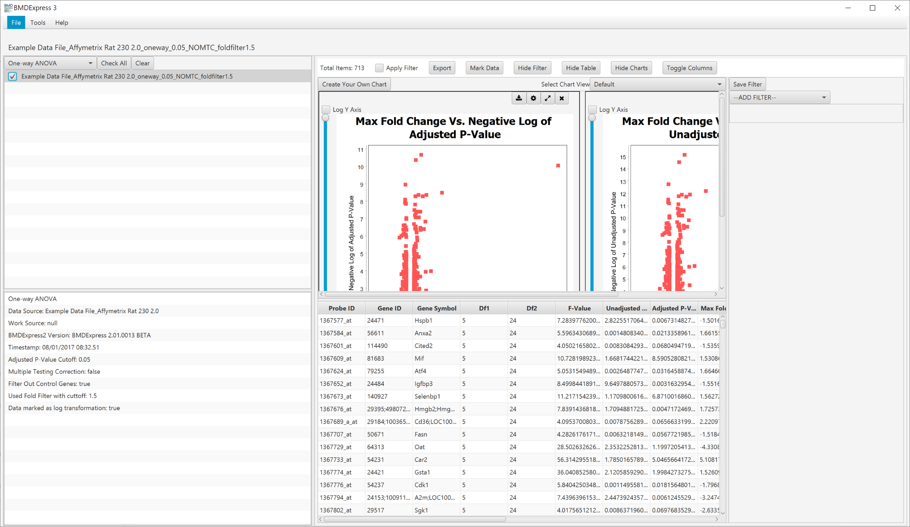

At the top of the main panel, there is a set of [toggles](overview#toggles-panel) that control various aspects of the prefilter analysis results view.

### Prefilter Visualizations

  
Click to show default visualizations.

- **Max Fold Change Vs. *-log10 Adjusted *P*-value***

    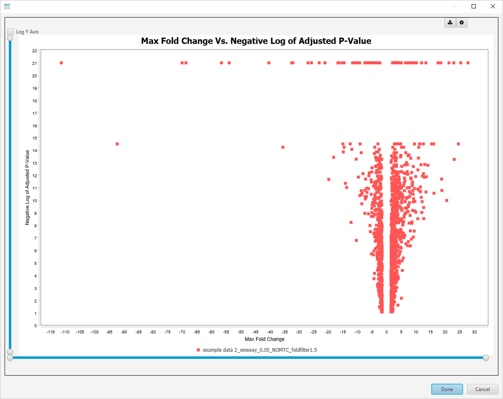
- **Max Fold Change Vs. *-log10 Unadjusted *P*-value***

    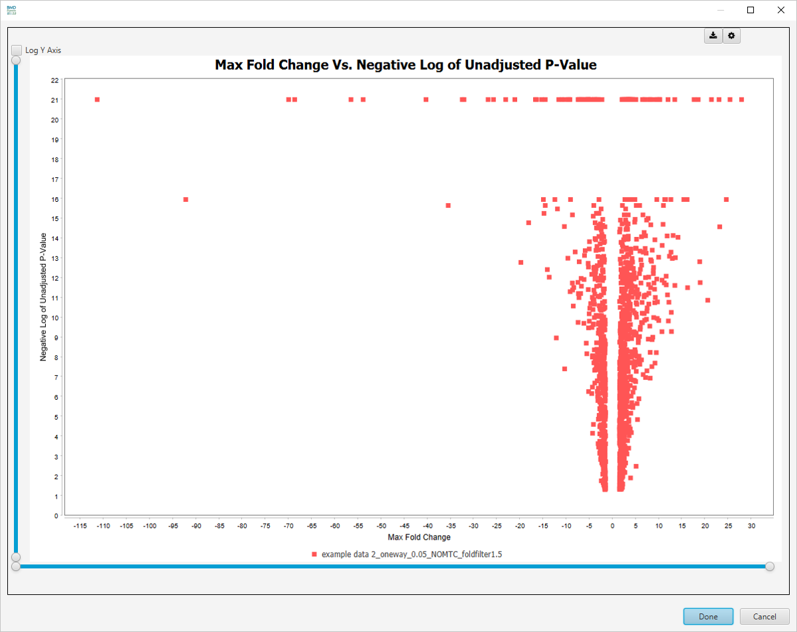

There are more visualizations available after clicking on `Select Graph View` dropdown list:

- **Unadjusted P-Value Histogram**

    
- **Adjusted P-Value Histogram**

    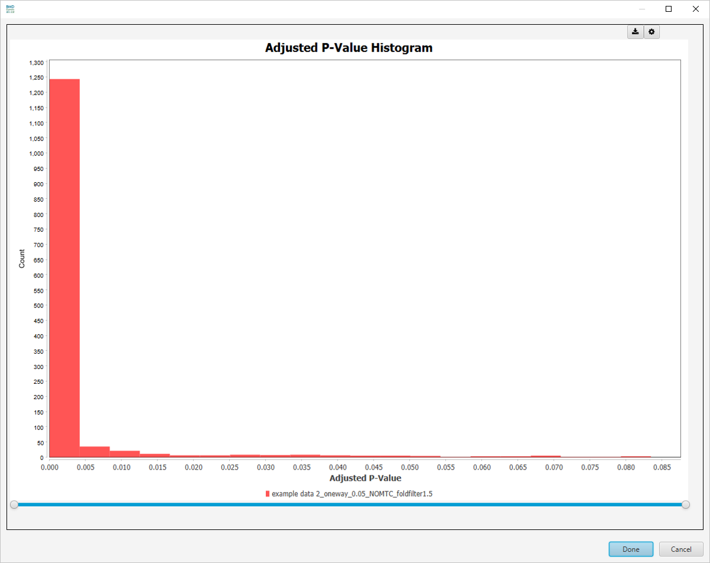
- **Best Fold Change Histogram**

    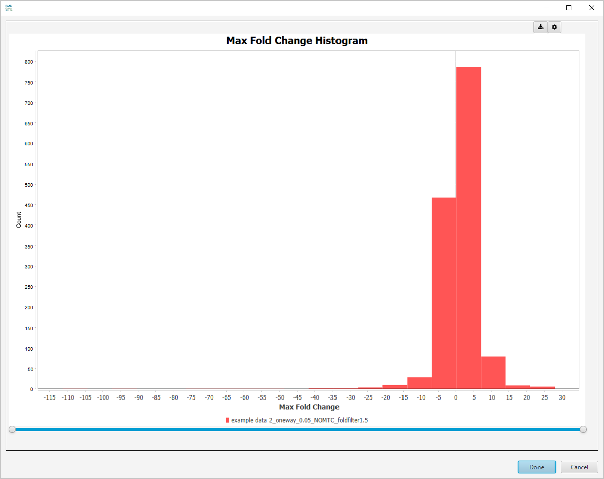
- **Best Fold Change (Unsigned) Histogram**

    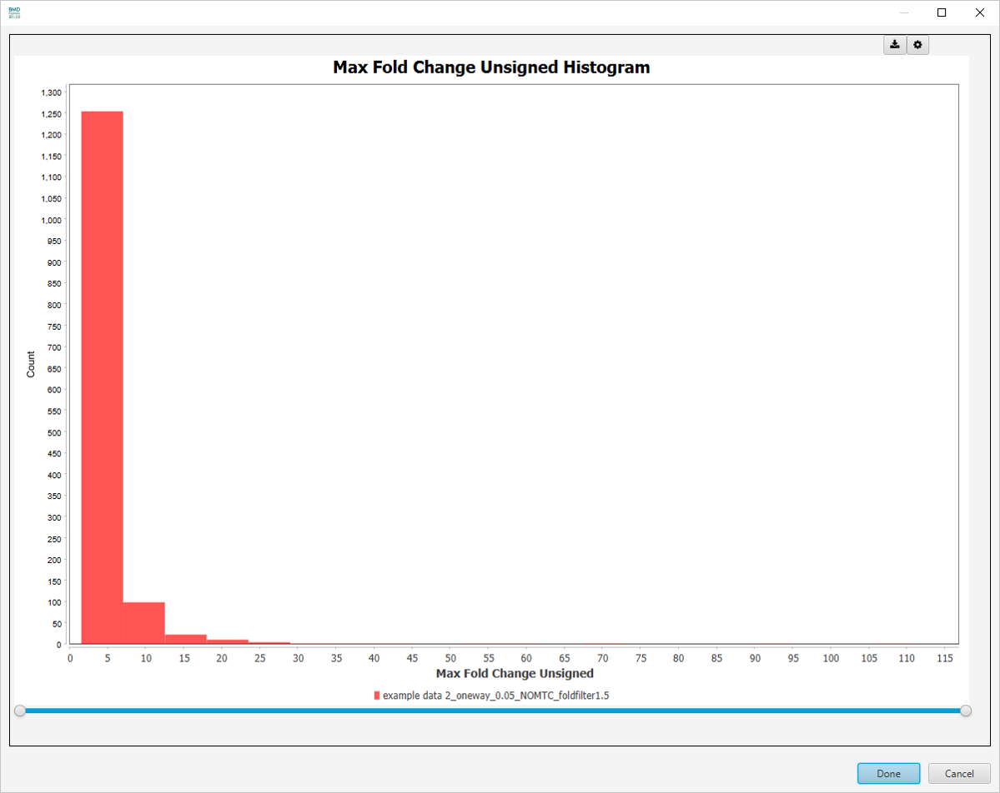
- **Venn Diagram**

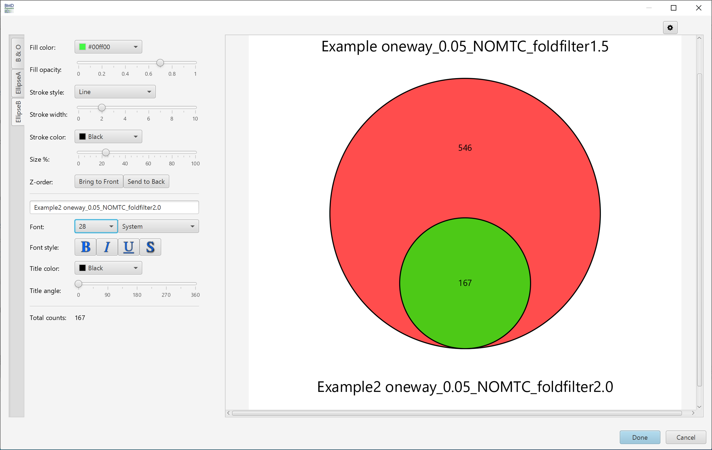

 

### Table and Visualization Filters

These parameters are changed via the [filter panel](overview#filters-panel). You must also make sure that the `Apply Filter` box is checked in the [toggles panel](overview#toggles-panel) for these filters to be applied. The filters will be applied as soon as they are entered; there is no need to click any *apply* button other than the checkbox.
